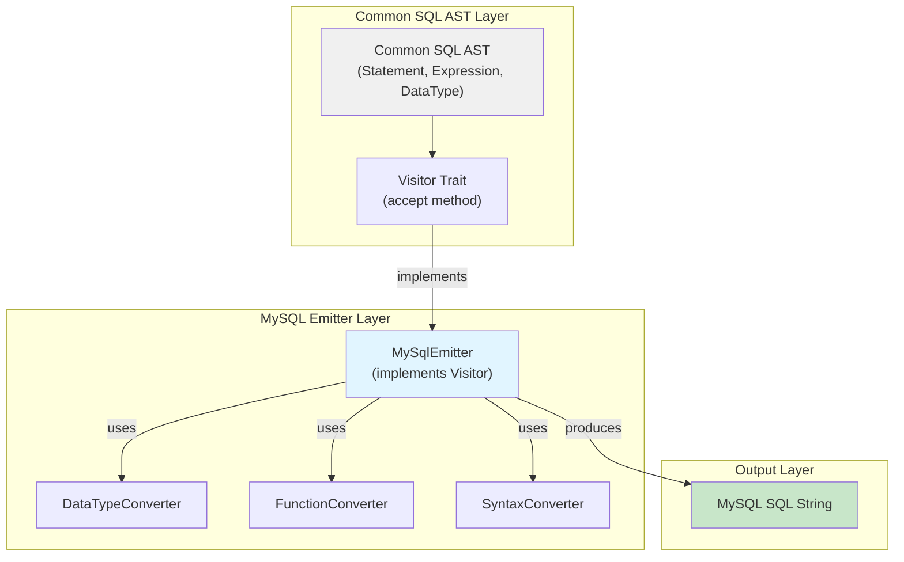
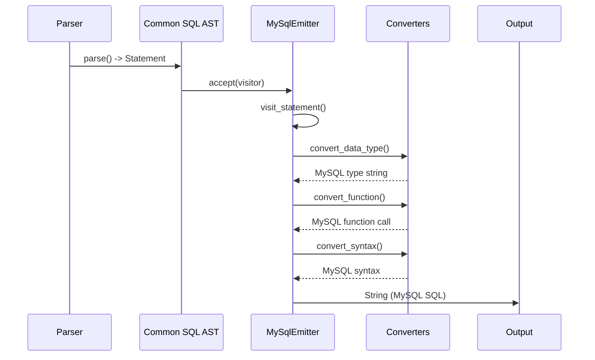
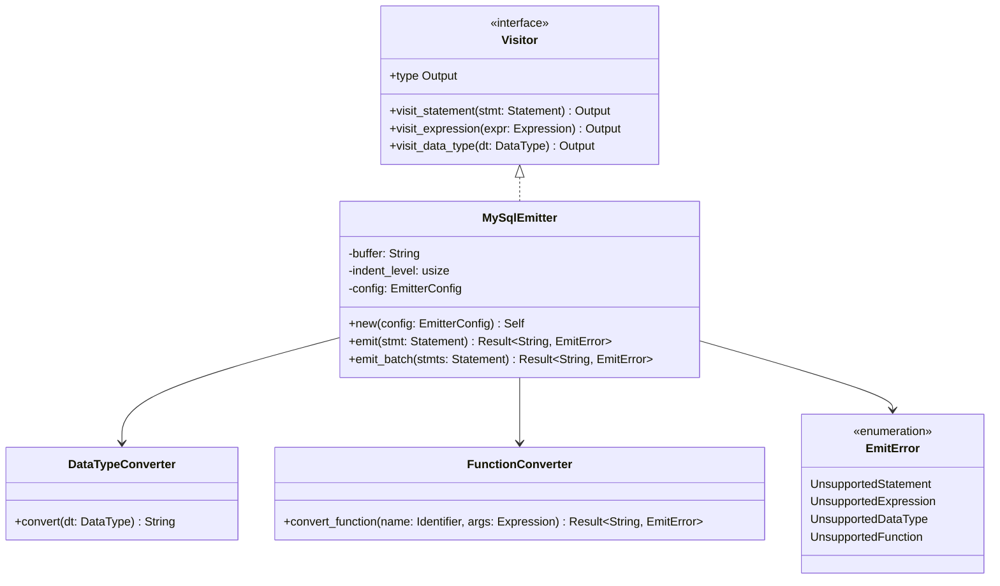

# MySQL Emitter - Design Document

## Overview

MySQL Emitter は、Common SQL AST を入力として受け取り、MySQL 方言の SQL 文字列を出力するライブラリである。Visitor パターンを使用して AST を巡回し、各ノードを MySQL 固有の構文に変換する。これにより、SAP ASE T-SQL で記述されたストアドプロシージャを MySQL で実行可能な SQL スクリプトに変換する。

### Goals

- Common SQL AST から MySQL SQL を生成する Visitor パターンを実装する
- T-SQL 固有の構文（データ型、関数、一時テーブル等）を MySQL 相当の構文に変換する
- アーキテクチャルールを遵守し、`common-sql-ast` のみに依存する
- 80%以上のテストカバレッジを達成する

### Non-Goals

- Common SQL AST の構築（Parser の責務）
- T-SQL の字句解析・構文解析（Lexer/Parser の責務）
- MySQL 以外の方言への対応（PostgreSQL Emitter など別コンポーネント）
- 実行時の SQL 検証や最適化

## Architecture

### Architecture Pattern & Boundary Map



**Architecture Integration**:
- **Selected pattern**: Visitor パターン（AST 巡回と SQL 生成の分離）
- **Domain boundaries**:
  - Common SQL AST 層：方言非依存のデータ構造
  - MySQL Emitter 層：MySQL 固有の変換ロジック
- **Existing patterns preserved**: Visitor/Visitable trait の契約
- **Steering compliance**: 単一責任の原則、依存逆転の原則

### Technology Stack

| Layer | Choice / Version | Role in Feature | Notes |
|-------|------------------|-----------------|-------|
| Language | Rust 2021 | 実装言語 | プロジェクト標準 |
| Dependency | common-sql-ast | AST 定義と Visitor trait | 唯一の依存先 |
| Error Handling | thiserror 2.0 | エラー型定義 | ワークスペース標準 |
| Testing | rstest 0.18 | テストフレームワーク | ワークスペース標準 |

## System Flows



## Requirements Traceability

| Requirement | Summary | Components | Interfaces | Flows |
|-------------|---------|------------|------------|-------|
| 1 | AST トラバーサル | MySqlEmitter | Visitor trait | AST 巡回 |
| 2 | データ型変換 | DataTypeConverter | visit_data_type | 型マッピング |
| 3 | 関数変換 | FunctionConverter | visit_function | 関数マッピング |
| 4 | 構文変換 | SyntaxConverter | visit_statement | 構文マッピング |
| 5-10 | 文生成 | MySqlEmitter | 各 visit_* メソッド | SQL 生成 |
| 11 | 変数代入 | SyntaxConverter | visit_variable_assignment | 構文変換 |
| 12 | 制御フロー | SyntaxConverter | visit_if/while | 構文変換 |
| 13 | エラーハンドリング | EmitError | 全メソッド | エラー伝播 |
| 14 | パフォーマンス | MySqlEmitter | - | 効率的な文字列構築 |
| 15 | テストカバレッジ | Tests | - | テストスイート |
| 16 | 出力フォーマット | Formatter | - | 整形 |
| 17 | 依存関係ルール | MySqlEmitter | - | 依存方向 |

## Components and Interfaces

### Component Summary

| Component | Domain/Layer | Intent | Req Coverage | Key Dependencies | Contracts |
|-----------|--------------|--------|--------------|------------------|-----------|
| MySqlEmitter | Emitter | AST を MySQL SQL に変換 | 1, 5-16 | common-sql-ast | Visitor |
| DataTypeConverter | Converter | データ型を変換 | 2 | - | - |
| FunctionConverter | Converter | 関数を変換 | 3 | - | - |
| SyntaxConverter | Converter | 構文を変換 | 4, 11-12 | - | - |
| EmitError | Error | エラー表現 | 13 | thiserror | - |
| Formatter | Output | SQL を整形 | 16 | - | - |

### Emitter Layer

#### MySqlEmitter

| Field | Detail |
|-------|--------|
| Intent | Visitor パターンで AST を巡回し、MySQL SQL を生成する |
| Requirements | 1, 5-16 |
| Owner / Reviewers | MySQL Emitter チーム |

**Responsibilities & Constraints**
- Common SQL AST の各ノードを MySQL SQL に変換する
- `common-sql-ast` のみに依存する（Lexer/Parser への依存禁止）
- `panic!` を使用せず、全てのエラーを `Result` で返す

**Dependencies**
- Inbound: Common SQL AST — Statement, Expression, DataType ノード (Critical)
- Outbound: なし（出力は String）
- External: なし

**Contracts**: API [ ]

##### API Contract

```rust
pub struct MySqlEmitter {
    /// 出力バッファ
    buffer: String,
    /// インデントレベル
    indent_level: usize,
    /// コンフィグ
    config: EmitterConfig,
}

pub struct EmitterConfig {
    /// 整形するかどうか
    pub format: bool,
    /// インデントサイズ
    pub indent_size: usize,
}

impl MySqlEmitter {
    /// 新しい Emitter を作成
    pub fn new(config: EmitterConfig) -> Self;

    /// Statement を MySQL SQL に変換
    pub fn emit(&mut self, stmt: &Statement) -> Result<String, EmitError>;

    /// 複数の Statement を MySQL SQL に変換
    pub fn emit_batch(&mut self, stmts: &[Statement]) -> Result<String, EmitError>;
}

// Visitor trait の実装
impl Visitor for MySqlEmitter {
    type Output = String;

    fn visit_statement(&mut self, stmt: &Statement) -> Self::Output;
    fn visit_expression(&mut self, expr: &Expression) -> Self::Output;
    fn visit_data_type(&mut self, data_type: &DataType) -> Self::Output;
    // ... その他の訪問メソッド
}
```

- Preconditions: 入力 AST は有効であること（Parser が検証済み）
- Postconditions: 出力される SQL は MySQL 8.0+ で構文的に有効であること
- Invariants: バッファの状態とインデントレベルが常に一致していること

**Implementation Notes**
- Integration: Parser が出力した AST を入力として受け取る
- Validation: 入力 AST の有効性は前提（軽量検証のみ実施）
- Risks:
  - MySQL でサポートされない機能の変換（警告コメントを出力）
  - DATEDIFF の引数順序の違い（変換ロジックで対応）

### Converter Layer

#### DataTypeConverter

| Field | Detail |
|-------|--------|
| Intent | Common SQL DataType を MySQL データ型文字列に変換 |
| Requirements | 2 |

```rust
pub struct DataTypeConverter;

impl DataTypeConverter {
    /// DataType を MySQL データ型文字列に変換
    pub fn convert(data_type: &DataType) -> String;

    /// 型パラメータをフォーマット
    fn format_params(precision: Option<u8>, scale: Option<u8>) -> String;
}
```

#### FunctionConverter

| Field | Detail |
|-------|--------|
| Intent | T-SQL 関数を MySQL 関数に変換 |
| Requirements | 3 |

```rust
pub struct FunctionConverter;

impl FunctionConverter {
    /// 関数呼び出しを MySQL 関数に変換
    pub fn convert_function(
        name: &Identifier,
        args: &[Expression],
        distinct: bool,
        emitter: &mut MySqlEmitter
    ) -> Result<String, EmitError>;

    /// 関数名をマッピング
    fn map_function_name(name: &str) -> Option<&'static str>;
}
```

#### SyntaxConverter

| Field | Detail |
|-------|--------|
| Intent | T-SQL 固有の構文を MySQL 構文に変換 |
| Requirements | 4, 11-12 |

```rust
pub struct SyntaxConverter;

impl SyntaxConverter {
    /// TOP n を LIMIT n に変換
    pub fn convert_top_to_limit(limit: &Expression) -> String;

    /// SELECT @var = expr を SET @var = (SELECT expr) に変換
    pub fn convert_variable_assignment(
        variable: &Identifier,
        expr: &Expression
    ) -> String;

    /// 一時テーブル名を変換
    pub fn convert_temp_table(name: &str) -> (String, bool);
    /// Returns (converted_name, is_global_temp)
}
```

### Error Layer

#### EmitError

| Field | Detail |
|-------|--------|
| Intent | Emitter のエラー表現 |
| Requirements | 13 |

```rust
#[derive(Debug, thiserror::Error)]
pub enum EmitError {
    #[error("Unsupported statement type: {0}")]
    UnsupportedStatement(String),

    #[error("Unsupported expression type: {0}")]
    UnsupportedExpression(String),

    #[error("Unsupported data type: {0}")]
    UnsupportedDataType(String),

    #[error("Unsupported function: {0}")]
    UnsupportedFunction(String),

    #[error("Buffer write error: {0}")]
    BufferError(String),
}
```

### Output Layer

#### Formatter

| Field | Detail |
|-------|--------|
| Intent | MySQL SQL を整形して出力 |
| Requirements | 16 |

```rust
pub struct Formatter {
    indent_size: usize,
}

impl Formatter {
    /// SQL を整形する
    pub fn format(sql: &str) -> String;

    /// インデントを生成
    fn indent(&self, level: usize) -> String;
}
```

## Data Models

### Domain Model



### Data Conversion Tables

#### DataType Mapping

| Common SQL | MySQL | Notes |
|-------------|-------|-------|
| TinyInt | TINYINT | - |
| SmallInt | SMALLINT | - |
| Int | INT | - |
| BigInt | BIGINT | - |
| Decimal { p, s } | DECIMAL(p,s) | - |
| Numeric { p, s } | DECIMAL(p,s) | MySQL では別名 |
| Real | DOUBLE | - |
| DoublePrecision | DOUBLE | - |
| Char { n } | CHAR(n) | - |
| VarChar { n } | VARCHAR(n) | - |
| Text | TEXT | - |
| NChar { n } | CHAR(n) | NATIONAL CHAR |
| NVarChar { n } | VARCHAR(n) | - |
| Date | DATE | - |
| Time { p } | TIME(p) | - |
| DateTime { p } | DATETIME(p) | - |
| Timestamp { p } | TIMESTAMP(p) | - |
| Binary { n } | BINARY(n) | - |
| VarBinary { n } | VARBINARY(n) | - |
| Blob | BLOB | - |
| Boolean | TINYINT(1) | - |
| Uuid | CHAR(36) | - |

#### Function Mapping

| T-SQL | MySQL | Notes |
|-------|-------|-------|
| GETDATE() | NOW() | - |
| GETUTCDATE() | UTC_TIMESTAMP() | - |
| DATEADD(part, n, date) | DATE_ADD(date, INTERVAL n part) | - |
| DATEDIFF(part, start, end) | DATEDIFF(end, start) | 引数順が逆 |
| LEN(s) | LENGTH(s) | - |
| SUBSTRING(s, start, len) | SUBSTRING(s, start, len) | - |
| LEFT(s, n) | LEFT(s, n) | - |
| RIGHT(s, n) | RIGHT(s, n) | - |
| LTRIM(s) | LTRIM(s) | - |
| RTRIM(s) | RTRIM(s) | - |
| CHARINDEX(s1, s2) | LOCATE(s1, s2) | - |
| REPLACE(s, old, new) | REPLACE(s, old, new) | - |
| REPLICATE(s, n) | REPEAT(s, n) | - |
| ISNULL(expr, default) | IFNULL(expr, default) | - |
| NEWID() | UUID() | - |
| ABS(n) | ABS(n) | - |
| CEILING(n) | CEIL(n) | - |
| FLOOR(n) | FLOOR(n) | - |
| ROUND(n, d) | ROUND(n, d) | - |
| POWER(x, y) | POW(x, y) | - |

## Error Handling

### Error Strategy

- **Unsupported features**: 警告コメントを出力して処理を継続
- **Critical errors**: `EmitError` を返して即座に失敗
- **Recovery**: 不可能（Emitter はステートレス）

### Error Categories and Responses

| Category | Response | Example |
|----------|----------|---------|
| Unsupported Statement | エラーを返す | CREATE PROCEDURE は未サポート |
| Unsupported Expression | 警告コメント + プレースホルダー | TABLESAMPLE 擬似 |
| Unsupported DataType | エラーを返す | SQL_VARIANT は未サポート |
| Unsupported Function | 警告コメント + 元の関数名 | カスタム関数 |
| Syntax Incompatibility | 変換 + 警告コメント | ##global_temp → 通常テーブル |

## Testing Strategy

### Unit Tests

- **DataTypeConverter**: 全データ型の変換（24パターン）
- **FunctionConverter**: 全関数の変換（27パターン）
- **SyntaxConverter**: 構文変換（TOP→LIMIT、変数代入等）
- **MySqlEmitter**: 各 visit_* メソッド

### Integration Tests

- **End-to-end**: T-SQL → Common SQL AST → MySQL SQL
- **Fixture-based**: 実際のストアドプロシージャを変換

### Test Coverage Targets

- **Overall**: 80% 以上
- **Critical paths** (DataType, Function, Syntax): 90% 以上
- **Error paths**: 全エラー分岐をカバー

### Test Organization

```
crates/mysql-emitter/
├── src/
│   └── ...
└── tests/
    ├── fixtures/
    │   ├── select.sql
    │   ├── insert.sql
    │   └── stored_procedures.sql
    └── integration_tests.rs
```

## Optional Sections

### Performance & Scalability

**Target metrics**:
- 1000行のストアドプロシージャ: 1秒以内に処理
- メモリ使用量: 入力サイズの O(n)

**Optimization techniques**:
- `String` ではなく `fmt::Write` を使用したバッファリング
- インデント計算のキャッシュ
- 関数マッピングの `HashMap` 化（静的初期化）

### Migration Strategy

既存のコードベースへの影響はありません。新規クレートとして追加されます。

## Supporting References

- Common SQL AST 仕様: `.kiro/specs/common-sql-ast/`
- アーキテクチャルール: `.claude/rules/architecture-coupling-balance.md`
- Rust スタイル: `.claude/rules/rust-style.md`
- Rust アンチパターン: `.claude/rules/rust-anti-patterns.md`
