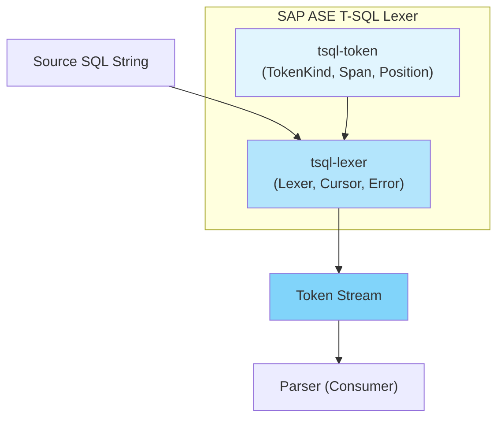
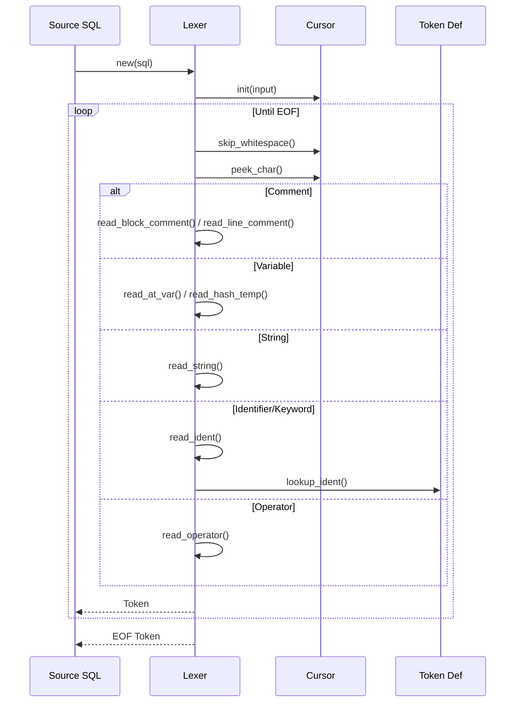
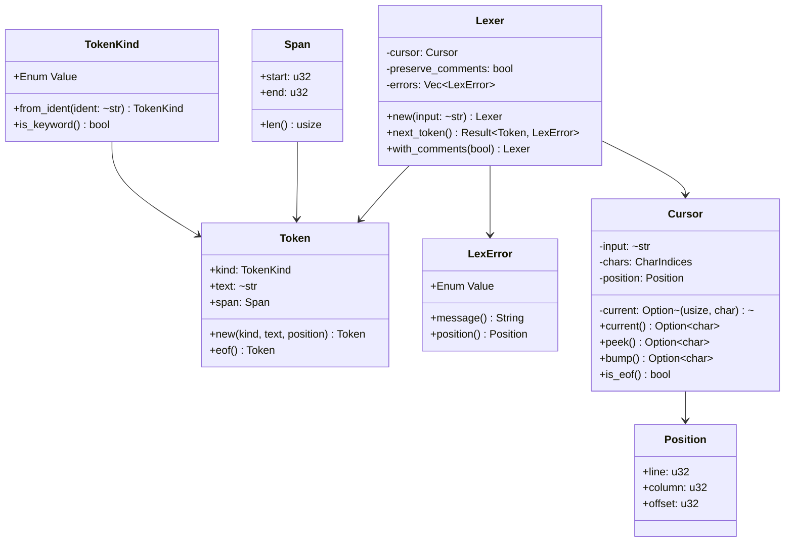

# Design Document: SAP ASE T-SQL Lexer

**Feature**: sap-ase-lexer
**Version**: 1.0.0
**Date**: 2026-01-20
**Language**: ja

---

## Overview

本デザインドキュメントは、SAP ASE (Sybase Adaptive Server Enterprise) の T-SQL 方言で記述された SQL コードを字句解析する Lexer の技術設計を定義する。Lexer は tsqlremaker プロジェクトの変換パイプラインの最初の工程として位置づけられ、ソース SQL コードをトークンストリームに変換する。

**Purpose**: SAP ASE T-SQL の完全なトークン化を提供し、Parser が正確に構文解析を行えるようにする。

**Users**: Parser (構文解析器)、変換エンジン、エンドユーザー（エラーメッセージの消費者）

**Impact**: 現在の部分的な実装から、SAP ASE 固有の構文（ネストされたコメント、変数プレフィックス、一時テーブル等）を完全にサポートする Lexer への移行。

### Goals

- SAP ASE T-SQL のすべての予約語、識別子、演算子、リテラルを正しくトークン化する
- ASE 固有の構文（ネストされたコメント、変数、一時テーブル）を正しく処理する
- エラー箇所を明確に示すエラーメッセージを出力する
- 大規模な SQL ファイル（1MB 以上）を 100ms 以下で処理する

### Non-Goals

- 構文解析（Parsing）は行わない - トークン化のみを担当
- SQL の実行や検証は行わない
- 他の SQL 方言（MS SQL Server、PostgreSQL 等）のサポートは将来の検討事項

---

## Architecture

### Existing Architecture Analysis

現在のアーキテクチャは `docs/SDD.md` で定義されている以下の構造に従う：

```
tsqlremaker/
├── crates/
│   ├── tsql-token/         # Token 定義（依存: なし）
│   ├── tsql-lexer/         # 字句解析器（依存: tsql-token）
│   ├── tsql-parser/        # 構文解析器（依存: tsql-lexer, common-sql）
│   └── common-sql/         # 共通 AST（依存: なし）
```

**既存のパターン**:
- ワークスペースベースの Cargo 構成
- Token 定義と Lexer の分離
- Zero-copy によるメモリ効率

**新規コンポーネント**: 本機能では既存の `tsql-token` と `tsql-lexer` を拡張する。

### Architecture Pattern & Boundary Map



**Architecture Integration**:
- **Selected pattern**: 手書き字句解析器（Hand-written Lexer）
- **Domain boundaries**: Token 定義（tsql-token）と字句解析ロジック（tsql-lexer）の分離
- **Existing patterns preserved**: Zero-copy Token、CharIndices ベースのカーソル
- **New components rationale**: ASE 固有のトークン種別とエラーハンドリングの追加

### Technology Stack

| Layer | Choice / Version | Role in Feature | Notes |
|-------|------------------|-----------------|-------|
| Language | Rust 1.75+ | 実装言語 | Zero-copy、型安全性、パフォーマンス |
| Crate | tsql-token (local) | Token 型定義 | TokenKind enum、Span、Position |
| Crate | tsql-lexer (local) | 字句解析器実装 | Lexer、Cursor、Error handling |
| Dependency | once_cell 1.19+ | 静的 HashMap | キーワード解決のパフォーマンス最適化 |

### Dependencies ( crates.io )

本プロジェクトで使用する外部ライブラリ（crates.io）の依存関係を定義します。

#### tsql-token / Cargo.toml

```toml
[package]
name = "tsql-token"
version = "0.1.0"
edition = "2021"

[dependencies]
# 静的 HashMap の構築に使用
once_cell = "1.19"

# エラーハンドリング用（Display, Error 実装）
thiserror = { version = "1.0", optional = true }

[dev-dependencies]
# ユニットテスト用
rstest = "0.18"

# プロパティベーステスト
proptest = "1.4"
```

#### tsql-lexer / Cargo.toml

```toml
[package]
name = "tsql-lexer"
version = "0.1.0"
edition = "2021"

[dependencies]
# Token 型定義
tsql-token = { path = "../tsql-token" }

# 静的 HashMap の構築
once_cell = "1.19"

# エラー型の定義
thiserror = "1.0"

[dev-dependencies]
# ユニットテストフレームワーク
rstest = "0.18"

# プロパティベーステスト（トークン化の検証）
proptest = "1.4"

# ベンチマーク
criterion = "0.5"

# カバレッジ
tarpaulin = { version = "0.27", optional = true }

# テスト用一時ディレクトリ
tempfile = "3.10"
```

#### Workspace / Cargo.toml (ルート)

```toml
[workspace]
members = ["crates/*"]
resolver = "2"

[workspace.dependencies]
# 共通バージョン管理
once_cell = "1.19"
thiserror = "1.0"
rstest = "0.18"
proptest = "1.4"

[workspace.metadata.cargo-semver-check]
# セマンティックバージョニングのチェック
```

### 依存ライブラリの説明

| ライブラリ | バージョン | 用途 | 選定理由 |
|----------|----------|------|----------|
| **once_cell** | 1.19+ | 静的 HashMap | Rust 1.70 未満との互換性、Lazy static の確立された実装 |
| **thiserror** | 1.0 | エラー型定義 | Display/Error の自動実装、エラーチェーン対応 |
| **rstest** | 0.18 | テスト | テーブル駆動テスト、フィクスチャサポート |
| **proptest** | 1.4 | プロパティベーステスト | トークン化のラウンドトリップ検証 |
| **criterion** | 0.5 | ベンチマーク | パフォーマンス測定、回帰検出 |
| **tarpaulin** | 0.27 | カバレッジ | Linux/Mac でのカバレッジ計測 |
| **tempfile** | 3.10 | テスト用ファイル | SQL ファイルの読み込みテスト |

### 採用しないライブラリと理由

| ライブラリ | 採用しない理由 |
|----------|---------------|
| **tokio / async-std / futures** | **Lexer は非同期処理不要**（後述） |
| **log / env_logger** | Lexer は副作用を持たない設計、ログは Parser 側で出力 |
| **regex** | SQL 字句解析は正規表現では困難（ネストコメント等） |
| **nom / pest** | パーサー combinator は Parser フェーズで検討、Lexer は手書きで実装 |
| **serde** | Token はシリアライズ不要（AST への変換時のみ必要） |
| **anyhow** | エラー型は型安全に定義するため thiserror を採用 |

### 非同期処理に関する設計判断

**結論**: Lexer は **同期関数** として実装し、非同期（async/await）は使用しない。

**理由**:

| 観点 | 説明 |
|------|------|
| **処理内容** | Lexer は純粋な計算処理（文字列 → トークン変換）であり、I/O 待ちが発生しない |
| **入力形态** | 入力は既にメモリ上に存在する `&str` であり、ファイル読み込みは呼び出し側の責務 |
| **パフォーマンス** | 非同期のランタイムコスト（オーバーヘッド）が無駄になる |
| **利便性** | 同期関数の方がテストが容易で、Iterator との統合も自然 |
| **責務分離** | ファイル読み込みは呼び出し側（CLI 等）が担当し、Lexer は字句解析のみを行う |

**呼び出し側での非同期処理の例**:

```rust
// 呼び出し側（CLI や Server）が非同期でファイルを読み込み
async fn read_and_tokenize(path: &Path) -> Result<Vec<Token>, Error> {
    // 非同期でファイル読み込み
    let content = tokio::fs::read_to_string(path).await?;

    // Lexer は同期的に実行（async 不要）
    let lexer = Lexer::new(&content);
    let tokens: Vec<_> = lexer.collect();

    Ok(tokens)
}
```

**将来的に非同期が必要になるケース**:
- 考えられない（Lexer の責務は不変）

### 依存関係の更新ポリシー

- **Major version**: 破壊的変更がある場合のみ更新
- **Minor version**: 自動更新 OK（CI でテスト実行）
- **Patch version**: 自動更新 OK（セキュリティフィックス優先）

---

## System Flows

### Tokenization Flow



### Error Recovery Flow

```mermaid
flowchart TD
    A[Next Token Request] --> B{Error Detected?}
    B -->|No| C[Return Token]
    B -->|Yes| D[Create Error Token]
    D --> E[Record Error Position]
    E --> F{Can Recover?}
    F -->|Yes| G[Skip to Sync Point<br/>(semicolon or keyword)]
    G --> A
    F -->|No| H[Return EOF]
```

---

## Requirements Traceability

| Requirement | Summary | Components | Interfaces | Flows |
|-------------|---------|------------|------------|-------|
| 1.1 | 基本的なトークン化（キーワード、識別子、演算子、区切り） | Lexer, TokenKind | ILexer::next_token() | Tokenization |
| 1.2 | 大文字小文字を区別せずにキーワードを認識 | TokenKind::from_ident() | Keyword lookup | - |
| 2.1 | ブロックコメント `/* */` の処理 | Lexer::read_block_comment() | ILexer::next_token() | Tokenization |
| 2.2 | ラインコメント `--` の処理 | Lexer::read_line_comment() | ILexer::next_token() | Tokenization |
| 2.3 | ネストされたブロックコメントのサポート | Lexer (depth tracking) | ILexer::next_token() | Tokenization |
| 2.4 | 終了していないコメントのエラー検出 | Lexer, LexError | Error handling | Error Recovery |
| 3.1 | ローカル変数 `@variable` のトークン化 | Lexer::read_at_var() | ILexer::next_token() | Tokenization |
| 3.2 | グローバル変数 `@@variable` のトークン化 | Lexer::read_at_var() | ILexer::next_token() | Tokenization |
| 3.3 | 一時テーブル `#table` のトークン化 | Lexer::read_hash_temp() | ILexer::next_token() | Tokenization |
| 3.4 | グローバル一時テーブル `##table` のトークン化 | Lexer::read_hash_temp() | ILexer::next_token() | Tokenization |
| 4.1 | 文字列リテラル `'...'` の処理 | Lexer::read_string() | ILexer::next_token() | Tokenization |
| 4.2 | Unicode 文字列 `N'...'` の処理 | Lexer::read_nstring() | ILexer::next_token() | Tokenization |
| 4.3 | Unicode エスケープ `U&'...'` の処理 | Lexer::read_unicode_string() | ILexer::next_token() | Tokenization |
| 4.4 | 終了していない文字列のエラー検出 | Lexer, LexError | Error handling | Error Recovery |
| 5.1 | 数値リテラル（整数、浮動小数点、科学表記）の処理 | Lexer::read_number() | ILexer::next_token() | Tokenization |
| 5.2 | 16進数リテラル `0x...` の処理 | Lexer::read_hex_string() | ILexer::next_token() | Tokenization |
| 6.1 | 演算子の優先度と結合性の認識 | TokenKind (operators) | ILexer::next_token() | - |
| 7.1 | 位置情報の追跡（行、列、オフセット） | Position, Span | Token, ILexer | Tokenization |
| 7.2 | エラー位置の表示 | LexError, SourceLocation | Error reporting | Error Recovery |
| 8.1 | 不正な文字の検出とエラー報告 | Lexer, LexError | Error handling | Error Recovery |
| 8.2 | エラーリカバリ（同期ポイントまでスキップ） | Lexer::synchronize() | ILexer::next_token() | Error Recovery |
| 9.1 | 予約語の認識（DML、DDL、制御フロー、データ型） | TokenKind, KEYWORDS | TokenKind::from_ident() | - |
| 10.1 | 引用符付き識別子 `[...]` の処理 | Lexer::read_quoted_ident() | ILexer::next_token() | Tokenization |
| 10.2 | 二重引用符識別子 `"..."` の処理 | Lexer::read_quoted_ident() | ILexer::next_token() | Tokenization |
| 11.1 | 静的 HashMap によるキーワード解決 | KEYWORDS (Lazy) | TokenKind::from_ident() | - |
| 11.2 | 大規模ファイルの高速処理（100ms 以下） | Lexer (zero-copy) | ILexer::next_token() | Tokenization |
| 12.1 | イテレータ可能なトークンストリーム | Lexer (Iterator impl) | IntoIterator | - |
| 12.2 | 先読み（peek）機能のサポート | Lexer::peek_token() | ILexer | Tokenization |
| 13.1 | 空白と改行の適切な処理 | Lexer::skip_whitespace() | ILexer::next_token() | Tokenization |
| 13.2 | CRLF と LF の両方の改行形式に対応 | Cursor | - | Tokenization |
| 14.1 | ASE 固有のグローバル変数の認識 | TokenKind (GlobalVar) | ILexer::next_token() | - |
| 15.1 | 拡張演算子（代入、複合代入、範囲）のトークン化 | Lexer::read_operator() | ILexer::next_token() | Tokenization |

---

## Components and Interfaces

### Component Summary

| Component | Domain/Layer | Intent | Req Coverage | Key Dependencies | Contracts |
|-----------|--------------|--------|--------------|------------------|-----------|
| TokenKind | tsql-token | Token 種別の定義 | 1, 6, 9, 14 | なし | Type |
| Position/Span | tsql-token | ソースコード位置情報 | 7 | なし | Type |
| LexError | tsql-lexer | 字句解析エラー型 | 2.4, 4.4, 8, 10.4 | Position, Span | Type |
| Cursor | tsql-lexer | 文字カーソル（状態管理） | 7, 13 | なし | State |
| Lexer | tsql-lexer | 字句解析器本体 | 全要件 | TokenKind, Cursor, LexError | Service |
| KEYWORDS | tsql-token | 静的キーワードマップ | 1.2, 11.1 | TokenKind | State |

### tsql-token Crate

#### TokenKind

| Field | Detail |
|-------|--------|
| Intent | トークン種別の型安全な列挙型定義 |
| Requirements | 1, 6, 9, 14 |
| Owner / Reviewers | - |

**Responsibilities & Constraints**
- すべての SAP ASE T-SQL トークン種別を網羅する
- Keyword と Literal/Operator を明確に区別する
- ASE 固有のトークン（LocalVar, GlobalVar, TempTable 等）を含む

**Dependencies**
- Inbound: なし
- Outbound: なし
- External: なし

**Contracts**: Type [X]

```rust
/// トークン種別の列挙型
#[derive(Debug, Clone, Copy, PartialEq, Eq, Hash)]
pub enum TokenKind {
    // ==================== Keywords ====================
    // DML
    Select, Insert, Update, Delete, Merge,
    From, Where, Join, Inner, Outer, Left, Right, Full, Cross,
    On, And, Or, Not, In, Exists, Between, Like, Is, Null,
    Order, By, Asc, Desc, Group, Having, Union, Intersect, Except,
    Distinct, All, Top, Limit, Offset, Fetch, First, Next, Rows, Only,

    // DDL
    Create, Alter, Drop, Truncate,
    Table, Index, View, Procedure, Proc, Function, Trigger,
    Database, Schema, Constraint, Primary, Foreign, Key, References,
    Unique, Check, Default, Identity, Autoincrement,

    // Control Flow
    If, Else, Begin, End, While, Return, Break, Continue,
    Case, When, Then, Else_, End_,
    Try, Catch, Throw, Raiserror,

    // Transaction
    Commit, Rollback, Transaction, Tran, Save, Savepoint,

    // Types
    Int, Integer, Smallint, Tinyint, Bigint,
    Float, Real, Double, Decimal, Numeric, Money, Smallmoney,
    Char, Varchar, Text, Nchar, Nvarchar, Ntext, Unichar, Univarchar, Unitext,
    Binary, Varbinary, Image,
    Date, Time, Datetime, Smalldatetime, Timestamp, Bigdatetime,
    Bit, Uniqueidentifier,

    // Misc Keywords
    As, Set, Declare, Exec, Execute, Into, Values, Output,
    Cursor, Open, Close, Deallocate, Fetch,
    Grant, Revoke, Deny,
    Print, Waitfor, Goto, Label,

    // ==================== Literals ====================
    Ident,              // 識別子
    QuotedIdent,        // [identifier] or "identifier"
    Number,             // 整数
    Float,              // 浮動小数点
    String,             // 'string'
    NString,            // N'unicode string'
    UnicodeString,      // U&'unicode escape string'
    HexString,          // 0xABCD

    // ==================== Operators ====================
    // Comparison
    Eq,                 // =
    Ne,                 // <> or !=
    NeAlt,              // <>
    Lt,                 // <
    Gt,                 // >
    Le,                 // <=
    Ge,                 // >=
    NotLt,              // !<
    NotGt,              // !>

    // Arithmetic
    Plus,               // +
    Minus,              // -
    Star,               // *
    Slash,              // /
    Percent,            // %

    // Bitwise
    Ampersand,          // &
    Pipe,               // |
    Caret,              // ^
    Tilde,              // ~

    // Assignment
    Assign,             // =
    PlusAssign,         // +=
    MinusAssign,        // -=
    StarAssign,         // *=
    SlashAssign,        // /=

    // String
    Concat,             // ||

    // ==================== Punctuation ====================
    LParen,             // (
    RParen,             // )
    LBracket,           // [
    RBracket,           // ]
    LBrace,             // {
    RBrace,             // }
    Comma,              // ,
    Semicolon,          // ;
    Colon,              // :
    Dot,                // .
    DotDot,             // ..

    // Variable prefixes
    LocalVar,           // @variable (dedicated token type)
    GlobalVar,          // @@variable (dedicated token type)
    TempTable,          // #table (dedicated token type)
    GlobalTempTable,    // ##table (dedicated token type)

    // ==================== Special ====================
    Whitespace,
    Newline,
    LineComment,        // -- comment
    BlockComment,       // /* comment */

    Eof,
    Unknown,
}
```

**Implementation Notes**
- Integration: TokenKind::from_ident() でキーワード解決
- Validation: すべての ASE 予約語を網羅すること
- Risks: 新しいキーワードの追加時に enum を更新する必要がある

#### Position / Span

| Field | Detail |
|-------|--------|
| Intent | ソースコード上の位置情報の表現 |
| Requirements | 7 |
| Owner / Reviewers | - |

**Contracts**: Type [X]

```rust
/// ソースコード上のバイト単位の範囲
#[derive(Debug, Clone, Copy, PartialEq, Eq)]
pub struct Span {
    pub start: u32,
    pub end: u32,
}

/// ソースコード上の人間可読な位置
#[derive(Debug, Clone, Copy, PartialEq, Eq)]
pub struct Position {
    pub line: u32,      // 1-indexed
    pub column: u32,    // 1-indexed (tab = 8 spaces)
    pub offset: u32,    // 0-indexed byte offset
}
```

#### Static Keyword Map (KEYWORDS)

| Field | Detail |
|-------|--------|
| Intent | 大文字小文字を区別せずにキーワードを解決する静的 HashMap |
| Requirements | 1.2, 11.1 |
| Owner / Reviewers | - |

**Contracts**: State [X]

```rust
use once_cell::sync::Lazy;
use std::collections::HashMap;

/// 静的キーワードマップ（プログラム起動時に1回のみ初期化）
static KEYWORDS: Lazy<HashMap<&'static str, TokenKind>> = Lazy::new(|| {
    let mut m = HashMap::with_capacity(150);

    // DML Keywords
    m.insert("select", TokenKind::Select);
    m.insert("insert", TokenKind::Insert);
    m.insert("update", TokenKind::Update);
    m.insert("delete", TokenKind::Delete);
    m.insert("merge", TokenKind::Merge);
    // ... (全キーワード)

    m
});

impl TokenKind {
    /// 識別子からキーワードを解決（大文字小文字非区別）
    pub fn from_ident(s: &str) -> Self {
        KEYWORDS
            .get(s.to_lowercase().as_str())
            .copied()
            .unwrap_or(TokenKind::Ident)
    }
}
```

**Implementation Notes**
- Integration: once_cell を使用して Lazy 静的初期化
- Validation: 全テストで大文字小文字の両方を確認
- Risks: なし

### tsql-lexer Crate

#### LexError

| Field | Detail |
|-------|--------|
| Intent | 字句解析エラーの型安全な表現 |
| Requirements | 2.4, 4.4, 8, 10.4 |
| Owner / Reviewers | - |

**Responsibilities & Constraints**
- エラーの種類と位置情報を保持する
- ユーザーに分かりやすいエラーメッセージを提供する

**Dependencies**
- Inbound: Lexer
- Outbound: Position, Span
- External: なし

**Contracts**: Type [X]

```rust
/// 字句解析エラー
#[derive(Debug, Clone, PartialEq)]
pub enum LexError {
    /// 終了していない文字列リテラル
    UnterminatedString {
        start: Position,
        quote_char: char,
    },

    /// 終了していないブロックコメント
    UnterminatedBlockComment {
        start: Position,
        depth: usize,
    },

    /// 終了していない引用符付き識別子
    UnterminatedIdentifier {
        start: Position,
        bracket_type: BracketType, // Square or DoubleQuote
    },

    /// 不正な文字
    InvalidCharacter {
        ch: char,
        position: Position,
    },

    /// 予期しない EOF
    UnexpectedEof {
        position: Position,
        expected: String,
    },
}

#[derive(Debug, Clone, Copy, PartialEq, Eq)]
pub enum BracketType {
    Square,      // [...]
    DoubleQuote, // "..."
}

impl LexError {
    /// エラーメッセージの生成
    pub fn message(&self) -> String {
        match self {
            Self::UnterminatedString { .. } => "Unterminated string literal",
            Self::UnterminatedBlockComment { .. } => "Unterminated block comment",
            Self::UnterminatedIdentifier { .. } => "Unterminated quoted identifier",
            Self::InvalidCharacter { ch, .. } => &format!("Invalid character in SQL: '{}'", ch),
            Self::UnexpectedEof { .. } => "Unexpected end of file",
        }.to_string()
    }

    /// エラー位置の取得
    pub fn position(&self) -> Position {
        match self {
            Self::UnterminatedString { start, .. } => *start,
            Self::UnterminatedBlockComment { start, .. } => *start,
            Self::UnterminatedIdentifier { start, .. } => *start,
            Self::InvalidCharacter { position, .. } => *position,
            Self::UnexpectedEof { position, .. } => *position,
        }
    }
}
```

#### Cursor

| Field | Detail |
|-------|--------|
| Intent | 文字レベルのカーソルと位置追跡 |
| Requirements | 7, 13 |
| Owner / Reviewers | - |

**Responsibilities & Constraints**
- 現在の文字と位置情報を追跡する
- 改行（CRLF/LF）とタブを正しく処理する
- 先読み（peek）機能を提供する

**Dependencies**
- Inbound: Lexer
- Outbound: なし
- External: なし

**Contracts**: State [X]

```rust
/// 文字カーソル
pub struct Cursor<'src> {
    input: &'src str,
    chars: std::str::CharIndices<'src>,
    current: Option<(usize, char)>,
    position: Position,
    tab_width: u32,
}

impl<'src> Cursor<'src> {
    pub fn new(input: &'src str) -> Self {
        let mut chars = input.char_indices();
        let current = chars.next();
        Self {
            input,
            chars,
            current,
            position: Position { line: 1, column: 1, offset: 0 },
            tab_width: 8,
        }
    }

    /// 現在の文字を取得
    pub fn current(&self) -> Option<char> {
        self.current.map(|(_, ch)| ch)
    }

    /// 次の文字を先読み（消費しない）
    pub fn peek(&self) -> Option<char> {
        self.chars.clone().next().map(|(_, ch)| ch)
    }

    /// 2文字先を先読み
    pub fn peek2(&self) -> Option<char> {
        let mut iter = self.chars.clone();
        iter.next();
        iter.next().map(|(_, ch)| ch)
    }

    /// 次の文字に進む
    pub fn bump(&mut self) -> Option<char> {
        let ch = self.current?;
        self.current = self.chars.next();

        // 位置情報の更新
        if ch == '\r' {
            // CRLF のチェック
            if self.current.map(|(_, c)| c) == Some('\n') {
                self.current = self.chars.next();
            }
            self.position.line += 1;
            self.position.column = 1;
        } else if ch == '\n' {
            self.position.line += 1;
            self.position.column = 1;
        } else if ch == '\t' {
            // タブ幅を8スペースとして計算
            self.position.column = ((self.position.column - 1 + 8) / 8) * 8 + 1;
        } else {
            self.position.column += 1;
        }

        self.position.offset += ch.len_utf8() as u32;

        Some(ch.1)
    }

    /// 現在の位置を取得
    pub fn position(&self) -> Position {
        self.position
    }

    /// EOF かどうか
    pub fn is_eof(&self) -> bool {
        self.current.is_none()
    }
}
```

**Implementation Notes**
- Integration: Lexer からのみ使用される
- Validation: 改行とタブの処理が正しいことをテストで確認
- Risks: Unicode サロゲートペアの処理に注意

#### Lexer

| Field | Detail |
|-------|--------|
| Intent | 字句解析器本体 - SQL ソースをトークンストリームに変換 |
| Requirements | 全要件 |
| Owner / Reviewers | - |

**Responsibilities & Constraints**
- ソース SQL をトークンに分解する
- エラーを検出し、適切にリカバリする
- 位置情報を正確に追跡する
- コメントをオプションで保持またはスキップする

**Dependencies**
- Inbound: Parser (Consumer)
- Outbound: TokenKind, Position, Span, LexError, Cursor
- External: once_cell

**Contracts**: Service [X]

```rust
/// 字句解析器
pub struct Lexer<'src> {
    cursor: Cursor<'src>,
    preserve_comments: bool,
    errors: Vec<LexError>,
}

impl<'src> Lexer<'src> {
    /// 新しい Lexer を作成
    pub fn new(input: &'src str) -> Self {
        Self {
            cursor: Cursor::new(input),
            preserve_comments: false,
            errors: Vec::new(),
        }
    }

    /// コメントを保持するか設定
    pub fn with_comments(mut self, preserve: bool) -> Self {
        self.preserve_comments = preserve;
        self
    }

    /// 次のトークンを取得
    pub fn next_token(&mut self) -> Result<Token<'src>, LexError> {
        self.skip_whitespace();

        if self.cursor.is_eof() {
            return Ok(Token::new(TokenKind::Eof, "", self.cursor.position()));
        }

        let start_pos = self.cursor.position();

        match self.cursor.current().ok_or(LexError::UnexpectedEof {
            position: self.cursor.position(),
            expected: "token".to_string(),
        })? {
            // コメント
            '/' if self.cursor.peek() == Some('*') => {
                self.read_block_comment()
            }
            '-' if self.cursor.peek() == Some('-') => {
                self.read_line_comment()
            }

            // 変数プレフィックス
            '@' => self.read_at_variable(),
            '#' => self.read_hash_temp(),

            // 引用符付き識別子
            '[' => self.read_bracket_ident(),
            '"' => self.read_quoted_ident(),

            // 文字列リテラル
            '\'' => self.read_string(),

            // 数値
            '0'..='9' => self.read_number(),

            // 演算子
            '+' => self.read_plus(),
            '-' => self.read_minus(),
            '*' => self.read_star(),
            '/' => self.read_slash(),
            '%' => Ok(Token::new(TokenKind::Percent, "%", start_pos)),
            '=' => Ok(Token::new(TokenKind::Assign, "=", start_pos)),
            '<' => self.read_less_than(),
            '>' => self.read_greater_than(),
            '!' => self.read_bang(),
            '&' => Ok(Token::new(TokenKind::Ampersand, "&", start_pos)),
            '|' => self.read_pipe(),
            '^' => Ok(Token::new(TokenKind::Caret, "^", start_pos)),
            '~' => Ok(Token::new(TokenKind::Tilde, "~", start_pos)),
            '.' => self.read_dot(),

            // 区切り文字
            '(' => Ok(Token::new(TokenKind::LParen, "(", start_pos)),
            ')' => Ok(Token::new(TokenKind::RParen, ")", start_pos)),
            ',' => Ok(Token::new(TokenKind::Comma, ",", start_pos)),
            ';' => Ok(Token::new(TokenKind::Semicolon, ";", start_pos)),
            ':' => Ok(Token::new(TokenKind::Colon, ":", start_pos)),

            // Unicode 文字列プレフィックス
            'U' | 'u' if self.cursor.peek() == Some('&') => {
                self.read_unicode_string()
            }

            // 識別子またはキーワード
            c if is_ident_start(c) => self.read_ident_or_keyword(),

            // 不正な文字
            c => Err(LexError::InvalidCharacter {
                ch: c,
                position: start_pos,
            }),
        }
    }

    /// ブロックコメントの読み取り（ネスト対応）
    fn read_block_comment(&mut self) -> Result<Token<'src>, LexError> {
        let start_pos = self.cursor.position();
        let start_offset = self.cursor.position().offset as usize;

        self.cursor.bump(); // '/'
        self.cursor.bump(); // '*'

        let mut depth = 1;

        while !self.cursor.is_eof() {
            match (self.cursor.current(), self.cursor.peek()) {
                (Some('/'), Some('*')) => {
                    // ネスト開始
                    depth += 1;
                    self.cursor.bump();
                    self.cursor.bump();
                }
                (Some('*'), Some('/')) => {
                    // ネスト終了
                    depth -= 1;
                    self.cursor.bump();
                    self.cursor.bump();
                    if depth == 0 {
                        break;
                    }
                }
                _ => {
                    self.cursor.bump();
                }
            }
        }

        if depth > 0 {
            return Err(LexError::UnterminatedBlockComment {
                start: start_pos,
                depth,
            });
        }

        let end_offset = self.cursor.position().offset as usize;
        let text = &self.cursor.input()[start_offset..end_offset];

        if self.preserve_comments {
            Ok(Token::new(TokenKind::BlockComment, text, start_pos))
        } else {
            // コメントをスキップして次のトークンを返す
            self.next_token()
        }
    }

    /// ラインコメントの読み取り
    fn read_line_comment(&mut self) -> Result<Token<'src>, LexError> {
        let start_pos = self.cursor.position();
        let start_offset = self.cursor.position().offset as usize;

        self.cursor.bump(); // first '-'
        self.cursor.bump(); // second '-'

        while !self.cursor.is_eof() && self.cursor.current() != Some('\n') {
            self.cursor.bump();
        }

        let end_offset = self.cursor.position().offset as usize;
        let text = &self.cursor.input()[start_offset..end_offset];

        if self.preserve_comments {
            Ok(Token::new(TokenKind::LineComment, text, start_pos))
        } else {
            // 改行を消費して次のトークンを返す
            if self.cursor.current() == Some('\n') {
                self.cursor.bump();
            }
            self.next_token()
        }
    }

    /// @ 変数の読み取り
    fn read_at_variable(&mut self) -> Result<Token<'src>, LexError> {
        let start_pos = self.cursor.position();
        let start_offset = self.cursor.position().offset as usize;

        self.cursor.bump(); // '@'

        let is_global = self.cursor.current() == Some('@');
        if is_global {
            self.cursor.bump(); // second '@'
        }

        let ident = self.read_ident_text();

        let end_offset = self.cursor.position().offset as usize;
        let text = &self.cursor.input()[start_offset..end_offset];

        let kind = if is_global {
            TokenKind::GlobalVar
        } else {
            TokenKind::LocalVar
        };

        Ok(Token::new(kind, text, start_pos))
    }

    /// # 一時テーブルの読み取り
    fn read_hash_temp(&mut self) -> Result<Token<'src>, LexError> {
        let start_pos = self.cursor.position();
        let start_offset = self.cursor.position().offset as usize;

        self.cursor.bump(); // '#'

        let is_global = self.cursor.current() == Some('#');
        if is_global {
            self.cursor.bump(); // second '#'
        }

        let ident = self.read_ident_text();

        let end_offset = self.cursor.position().offset as usize;
        let text = &self.cursor.input()[start_offset..end_offset];

        let kind = if is_global {
            TokenKind::GlobalTempTable
        } else {
            TokenKind::TempTable
        };

        Ok(Token::new(kind, text, start_pos))
    }

    /// 識別子テキストの読み取り（共通処理）
    fn read_ident_text(&mut self) -> String {
        let mut result = String::new();

        while let Some(ch) = self.cursor.current() {
            if ch.is_alphanumeric() || ch == '_' || ch == '$' {
                result.push(ch);
                self.cursor.bump();
            } else if ch == '.' {
                // ドットは識別子の一部として許可（qualified name）
                result.push(ch);
                self.cursor.bump();
            } else {
                break;
            }
        }

        result
    }

    /// 識別子またはキーワードの読み取り
    fn read_ident_or_keyword(&mut self) -> Result<Token<'src>, LexError> {
        let start_pos = self.cursor.position();
        let start_offset = self.cursor.position().offset as usize;

        let ident = self.read_ident_text();

        let end_offset = self.cursor.position().offset as usize;
        let text = &self.cursor.input()[start_offset..end_offset];

        // キーワード解決
        let kind = TokenKind::from_ident(text);

        Ok(Token::new(kind, text, start_pos))
    }

    /// 文字列リテラルの読み取り
    fn read_string(&mut self) -> Result<Token<'src>, LexError> {
        let start_pos = self.cursor.position();
        let start_offset = self.cursor.position().offset as usize;

        self.cursor.bump(); // opening quote

        while !self.cursor.is_eof() {
            match self.cursor.current() {
                Some('\'') => {
                    // エスケープチェック（''）
                    if self.cursor.peek() == Some('\'') {
                        self.cursor.bump();
                        self.cursor.bump();
                    } else {
                        // 終了
                        self.cursor.bump();
                        break;
                    }
                }
                _ => {
                    self.cursor.bump();
                }
            }
        }

        if self.cursor.is_eof() && self.cursor.current() != Some('\'') {
            return Err(LexError::UnterminatedString {
                start: start_pos,
                quote_char: '\'',
            });
        }

        let end_offset = self.cursor.position().offset as usize;
        let text = &self.cursor.input()[start_offset..end_offset];

        Ok(Token::new(TokenKind::String, text, start_pos))
    }

    /// Unicode エスケープ文字列の読み取り (U&'...')
    fn read_unicode_string(&mut self) -> Result<Token<'src>, LexError> {
        let start_pos = self.cursor.position();
        let start_offset = self.cursor.position().offset as usize;

        self.cursor.bump(); // 'U' or 'u'
        self.cursor.bump(); // '&'

        let quote = self.cursor.current().ok_or(LexError::UnexpectedEof {
            position: self.cursor.position(),
            expected: "quote".to_string(),
        })?;

        if quote != '\'' && quote != '"' {
            return Err(LexError::InvalidCharacter {
                ch: quote,
                position: self.cursor.position(),
            });
        }

        self.cursor.bump(); // opening quote

        while !self.cursor.is_eof() {
            match self.cursor.current() {
                Some(q) if q == quote => {
                    if self.cursor.peek() != Some(q) {
                        self.cursor.bump();
                        break;
                    }
                    // エスケープ
                    self.cursor.bump();
                    self.cursor.bump();
                }
                Some('\\') => {
                    // Unicode エスケープシーケンス
                    self.cursor.bump();
                    if self.cursor.current() == Some('+') {
                        self.cursor.bump();
                        // \+XXXXXX (6 hex digits)
                        for _ in 0..6 {
                            self.cursor.bump();
                        }
                    } else {
                        // \XXXX (4 hex digits)
                        for _ in 0..4 {
                            self.cursor.bump();
                        }
                    }
                }
                _ => {
                    self.cursor.bump();
                }
            }
        }

        let end_offset = self.cursor.position().offset as usize;
        let text = &self.cursor.input()[start_offset..end_offset];

        Ok(Token::new(TokenKind::UnicodeString, text, start_pos))
    }

    /// 角括弧付き識別子の読み取り
    fn read_bracket_ident(&mut self) -> Result<Token<'src>, LexError> {
        let start_pos = self.cursor.position();
        let start_offset = self.cursor.position().offset as usize;

        self.cursor.bump(); // '['

        while !self.cursor.is_eof() {
            match self.cursor.current() {
                Some(']') => {
                    if self.cursor.peek() == Some(']') {
                        // エスケープ ]]
                        self.cursor.bump();
                        self.cursor.bump();
                    } else {
                        self.cursor.bump();
                        break;
                    }
                }
                _ => {
                    self.cursor.bump();
                }
            }
        }

        if self.cursor.is_eof() {
            return Err(LexError::UnterminatedIdentifier {
                start: start_pos,
                bracket_type: BracketType::Square,
            });
        }

        let end_offset = self.cursor.position().offset as usize;
        let text = &self.cursor.input()[start_offset..end_offset];

        Ok(Token::new(TokenKind::QuotedIdent, text, start_pos))
    }

    /// 数値リテラルの読み取り
    fn read_number(&mut self) -> Result<Token<'src>, LexError> {
        let start_pos = self.cursor.position();
        let start_offset = self.cursor.position().offset as usize;

        // 16進数チェック
        if self.cursor.current() == Some('0')
            && self.cursor.peek() == Some('x') {
            return self.read_hex_number();
        }

        let mut has_dot = false;
        let mut has_exponent = false;

        while let Some(ch) = self.cursor.current() {
            if ch.is_numeric() {
                self.cursor.bump();
            } else if ch == '.' && !has_dot {
                has_dot = true;
                self.cursor.bump();
                // ドットの後に数字がない場合は範囲演算子
                if !self.cursor.current().map(|c| c.is_numeric()).unwrap_or(false) {
                    // ドットを戻して整数として処理
                    break;
                }
            } else if (ch == 'e' || ch == 'E') && !has_exponent {
                has_exponent = true;
                self.cursor.bump();
                // 符号を許容
                if self.cursor.current() == Some('+') || self.cursor.current() == Some('-') {
                    self.cursor.bump();
                }
            } else {
                break;
            }
        }

        let end_offset = self.cursor.position().offset as usize;
        let text = &self.cursor.input()[start_offset..end_offset];

        let kind = if has_dot || has_exponent {
            TokenKind::Float
        } else {
            TokenKind::Number
        };

        Ok(Token::new(kind, text, start_pos))
    }

    /// 16進数リテラルの読み取り
    fn read_hex_number(&mut self) -> Result<Token<'src>, LexError> {
        let start_pos = self.cursor.position();
        let start_offset = self.cursor.position().offset as usize;

        self.cursor.bump(); // '0'
        self.cursor.bump(); // 'x'

        while let Some(ch) = self.cursor.current() {
            if ch.is_ascii_hexdigit() {
                self.cursor.bump();
            } else {
                break;
            }
        }

        let end_offset = self.cursor.position().offset as usize;
        let text = &self.cursor.input()[start_offset..end_offset];

        Ok(Token::new(TokenKind::HexString, text, start_pos))
    }

    /// 演算子の読み取りメソッド（一部）
    fn read_plus(&mut self) -> Result<Token<'src>, LexError> {
        let pos = self.cursor.position();
        self.cursor.bump();

        if self.cursor.current() == Some('=') {
            self.cursor.bump();
            Ok(Token::new(TokenKind::PlusAssign, "+=", pos))
        } else {
            Ok(Token::new(TokenKind::Plus, "+", pos))
        }
    }

    fn read_less_than(&mut self) -> Result<Token<'src>, LexError> {
        let pos = self.cursor.position();
        self.cursor.bump();

        match self.cursor.current() {
            Some('=') => {
                self.cursor.bump();
                Ok(Token::new(TokenKind::Le, "<=", pos))
            }
            Some('>') => {
                self.cursor.bump();
                Ok(Token::new(TokenKind::NeAlt, "<>", pos))
            }
            _ => Ok(Token::new(TokenKind::Lt, "<", pos)),
        }
    }

    fn read_greater_than(&mut self) -> Result<Token<'src>, LexError> {
        let pos = self.cursor.position();
        self.cursor.bump();

        if self.cursor.current() == Some('=') {
            self.cursor.bump();
            Ok(Token::new(TokenKind::Ge, ">=", pos))
        } else {
            Ok(Token::new(TokenKind::Gt, ">", pos))
        }
    }

    fn read_bang(&mut self) -> Result<Token<'src>, LexError> {
        let pos = self.cursor.position();
        self.cursor.bump();

        match self.cursor.current() {
            Some('=') => {
                self.cursor.bump();
                Ok(Token::new(TokenKind::Ne, "!=", pos))
            }
            Some('<') => {
                self.cursor.bump();
                Ok(Token::new(TokenKind::NotLt, "!<", pos))
            }
            Some('>') => {
                self.cursor.bump();
                Ok(Token::new(TokenKind::NotGt, "!>", pos))
            }
            _ => Err(LexError::InvalidCharacter {
                ch: '!',
                position: pos,
            }),
        }
    }

    fn read_pipe(&mut self) -> Result<Token<'src>, LexError> {
        let pos = self.cursor.position();
        self.cursor.bump();

        if self.cursor.current() == Some('|') {
            self.cursor.bump();
            Ok(Token::new(TokenKind::Concat, "||", pos))
        } else {
            Ok(Token::new(TokenKind::Pipe, "|", pos))
        }
    }

    fn read_dot(&mut self) -> Result<Token<'src>, LexError> {
        let pos = self.cursor.position();
        self.cursor.bump();

        if self.cursor.current() == Some('.') {
            self.cursor.bump();
            Ok(Token::new(TokenKind::DotDot, "..", pos))
        } else {
            Ok(Token::new(TokenKind::Dot, ".", pos))
        }
    }

    fn read_minus(&mut self) -> Result<Token<'src>, LexError> {
        let pos = self.cursor.position();
        self.cursor.bump();

        // ラインコメントは上位で処理済み
        match self.cursor.current() {
            Some('=') => {
                self.cursor.bump();
                Ok(Token::new(TokenKind::MinusAssign, "-=", pos))
            }
            _ => Ok(Token::new(TokenKind::Minus, "-", pos)),
        }
    }

    fn read_star(&mut self) -> Result<Token<'src>, LexError> {
        let pos = self.cursor.position();
        self.cursor.bump();

        if self.cursor.current() == Some('=') {
            self.cursor.bump();
            Ok(Token::new(TokenKind::StarAssign, "*=", pos))
        } else {
            Ok(Token::new(TokenKind::Star, "*", pos))
        }
    }

    fn read_slash(&mut self) -> Result<Token<'src>, LexError> {
        let pos = self.cursor.position();
        self.cursor.bump();

        if self.cursor.current() == Some('=') {
            self.cursor.bump();
            Ok(Token::new(TokenKind::SlashAssign, "/=", pos))
        } else {
            Ok(Token::new(TokenKind::Slash, "/", pos))
        }
    }

    /// 空白をスキップ
    fn skip_whitespace(&mut self) {
        while let Some(ch) = self.cursor.current() {
            if ch.is_whitespace() && ch != '\n' && ch != '\r' {
                self.cursor.bump();
            } else {
                break;
            }
        }
    }

    /// エラーの取得
    pub fn errors(&self) -> &[LexError] {
        &self.errors
    }
}

/// 識別子の開始文字かどうか
fn is_ident_start(ch: char) -> bool {
    ch.is_alphabetic() || ch == '_'
}
```

**Implementation Notes**
- Integration: Parser から `next_token()` を呼び出して使用
- Validation: すべてのトークン種別のテストケースを作成
- Risks: エラーリカバリの挙動を慎重に設計する必要がある

#### Token Structure

| Field | Detail |
|-------|--------|
| Intent | Zero-copy トークン表現 |
| Requirements | 1, 7, 11 |
| Owner / Reviewers | - |

**Contracts**: Type [X]

```rust
/// Zero-copy Token
#[derive(Debug, Clone, Copy)]
pub struct Token<'src> {
    pub kind: TokenKind,
    pub text: &'src str,    // ソースへの参照（コピーなし）
    pub span: Span,
}

impl<'src> Token<'src> {
    pub fn new(kind: TokenKind, text: &'src str, position: Position) -> Self {
        Self {
            kind,
            text,
            span: Span {
                start: position.offset,
                end: position.offset + text.len() as u32,
            },
        }
    }

    pub fn eof() -> Self {
        Self {
            kind: TokenKind::Eof,
            text: "",
            span: Span { start: 0, end: 0 },
        }
    }
}

/// イテレータ実装
impl<'src> Iterator for Lexer<'src> {
    type Item = Result<Token<'src>, LexError>;

    fn next(&mut self) -> Option<Self::Item> {
        let token = self.next_token();
        match token {
            Ok(t) if t.kind == TokenKind::Eof => None,
            other => Some(other),
        }
    }
}
```

---

## Data Models

### Domain Model



---

## Error Handling

### Error Strategy

1. **即時エラー復帰**: トークンレベルでエラーを検出した場合、`Err(LexError)` を返す
2. **エラー蓄積**: エラーを内部ベクタに蓄積し、後でまとめて報告可能
3. **同期ポイント**: セミコロンまたは文の開始キーワードまでスキップしてリカバリ

### Error Categories and Responses

| カテゴリ | エラー型 | 回復方法 |
|----------|----------|----------|
| 文字列エラー | `UnterminatedString` | 次の引用符または同期ポイントまでスキップ |
| コメントエラー | `UnterminatedBlockComment` | EOF まで読み取り、エラーを報告 |
| 識別子エラー | `UnterminatedIdentifier` | 次の閉じ括弧または同期ポイントまでスキップ |
| 文字エラー | `InvalidCharacter` | 不正な文字をスキップして継続 |
| EOF エラー | `UnexpectedEof` | EOF トークンを返して終了 |

### Monitoring

```rust
// エラー収集インターフェース
impl<'src> Lexer<'src> {
    /// 収集されたエラーの取得
    pub fn drain_errors(&mut self) -> Vec<LexError> {
        std::mem::take(&mut self.errors)
    }

    /// エラーがあるかどうか
    pub fn has_errors(&self) -> bool {
        !self.errors.is_empty()
    }
}
```

---

## Testing Strategy

### Unit Tests

**Core Functionality**:
1. キーワード認識（大文字小文字の両方）
2. 識別子とキーワードの区別
3. 演算子の認識（単一文字と複合）
4. 数値リテラル（整数、浮動小数点、16進数）

**Comments**:
5. ブロックコメント（単純）
6. ネストされたブロックコメント
7. ラインコメント
8. 終了していないコメントのエラー検出

**Variables & Temp Tables**:
9. ローカル変数 `@var`
10. グローバル変数 `@@var`
11. 一時テーブル `#table`
12. グローバル一時テーブル `##table`

**Strings**:
13. 通常文字列リテラル
14. エスケープされたクォート
15. Unicode 文字列 `N'...'`
16. Unicode エスケープ文字列 `U&'...'`
17. 終了していない文字列のエラー検出

**Operators**:
18. 算術演算子
19. 比較演算子
20. ビット演算子
21. 代入演算子と複合代入演算子
22. 文字列連結演算子 `||`

**Position Tracking**:
23. 行番号の正確な追跡
24. 列番号の正確な追跡（タブを考慮）
25. 改行形式（CRLF/LF）の両方に対応

### Integration Tests

1. 完全な SELECT クエリ
2. CREATE PROCEDURE 文
3. 複雑な JOIN を含むクエリ
4. エラーを含む SQL のリカバリ
5. 大規模ファイル（10,000行以上）のパフォーマンス

### Performance Tests

1. 1MB の SQL ファイルを 100ms 以下で処理
2. キーワード解決の HashMap ヒット率
3. Zero-copy のメモリ効率

---

## Performance & Scalability

### Target Metrics

| メトリック | 目標値 | 測定方法 |
|------------|--------|----------|
| 1MB ファイル処理時間 | < 100ms | ベンチマークテスト |
| メモリ使用量 | < ソースサイズの 1.2 倍 | プロファイラ |
| キーワード解決時間 | O(1) | HashMap ルックアップ |

### Optimization Strategies

1. **静的 HashMap**: `once_cell::sync::Lazy` によるプログラム起動時の1回のみ初期化
2. **Zero-copy**: ソース文字列への参照を保持し、文字列コピーを回避
3. **効率的なカーソル**: `CharIndices` イテレータを使用した文字列トラバーサル

---

## Implementation Plan

### Phase 1: 基盤整備
1. `TokenKind` enum の完全定義
2. `Position`, `Span` 構造体の実装
3. `Cursor` の実装
4. 静的キーワードマップの構築

### Phase 2: コメントと空白
5. ブロックコメント（ネスト対応）
6. ラインコメント
7. 空白スキップ
8. 改行とタブの処理

### Phase 3: 変数と識別子
9. `@` 変数プレフィックス
10. `@@` グローバル変数
11. `#` 一時テーブル
12. `##` グローバル一時テーブル
13. 識別子とキーワード解決

### Phase 4: リテラル
14. 文字列リテラル
15. Unicode 文字列 `N'...'`
16. Unicode エスケープ `U&'...'`
17. 数値リテラル（整数、浮動小数点、16進数）

### Phase 5: 演算子と区切り文字
18. 算術演算子と複合代入
19. 比較演算子（ASE 拡張を含む）
20. ビット演算子
21. 文字列連結 `||`
22. 区切り文字（括弧、カンマ、セミコロン等）

### Phase 6: エラーハンドリング
23. `LexError` 型の実装
24. エラー位置の追跡
25. エラーリカバリ機構
26. エラーメッセージの生成

### Phase 7: 機能拡張
27. 引用符付き識別子
28. イテレータ実装
29. 先読み（peek）機能
30. コメント保持オプション

---

## Supporting References

### TokenKind Full Definition

完全な `TokenKind` enum 定義は `docs/SDD.md` の Section 3.1.1 を参照。

### ASE T-SQL Syntax

SAP ASE の構文詳細は以下のドキュメントを参照:
- `docs/EXECUTIVE_SUMMARY.md` - ASE 固有機能の概要
- `docs/LEXER_ROADMAP.md` - 実装ロードマップ
- `docs/SAP_ASE_TSQL_DIALECT_ANALYSIS.md` - 方言分析

### Existing Implementation

現在の実装と既知の問題:
- `tsql-token/src/lib.rs` - 現在の Token 定義
- `tsql-lexer/src/lib.rs` - 現在の Lexer 実装（バグ含む）
