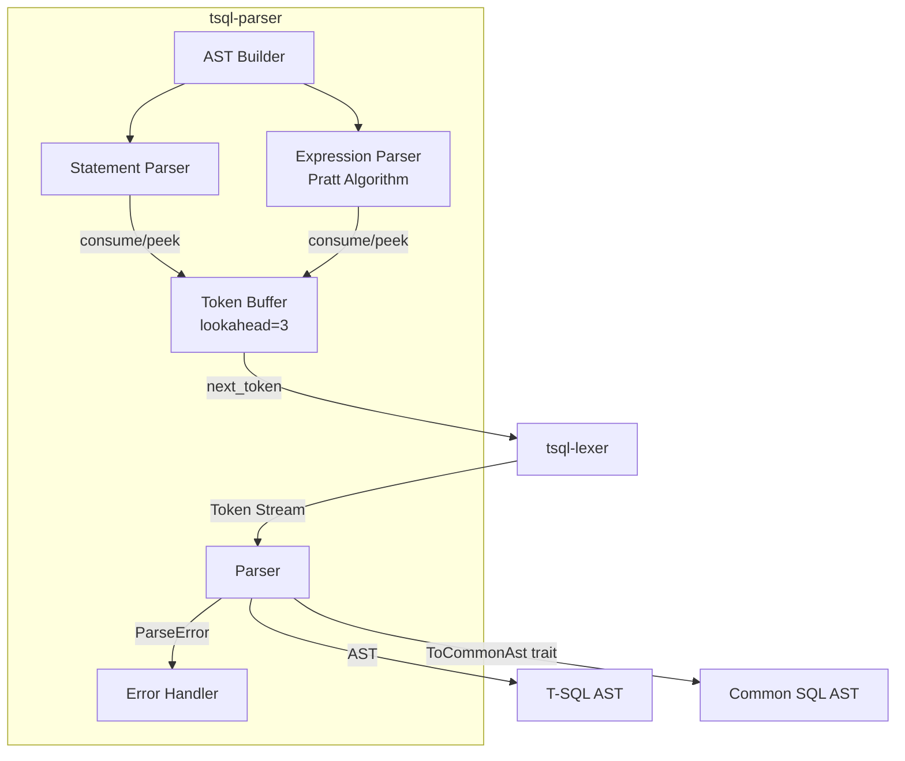
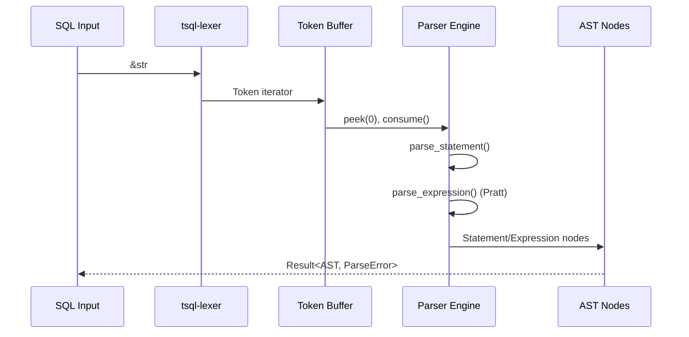
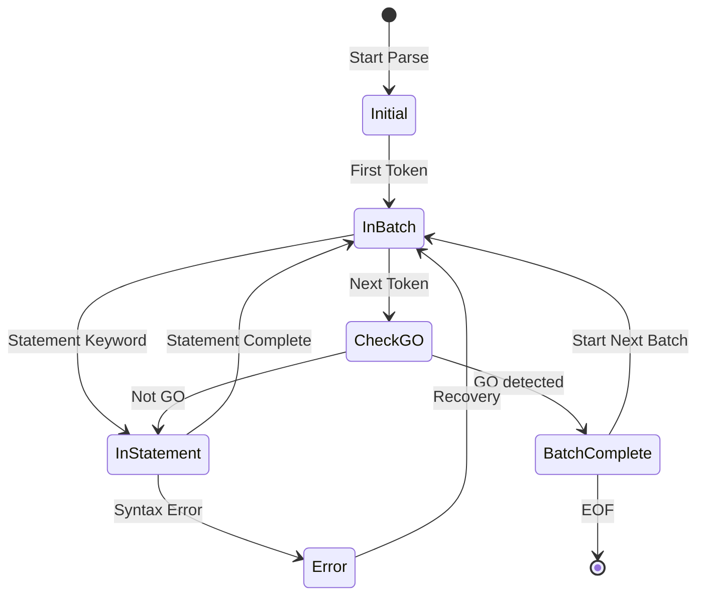
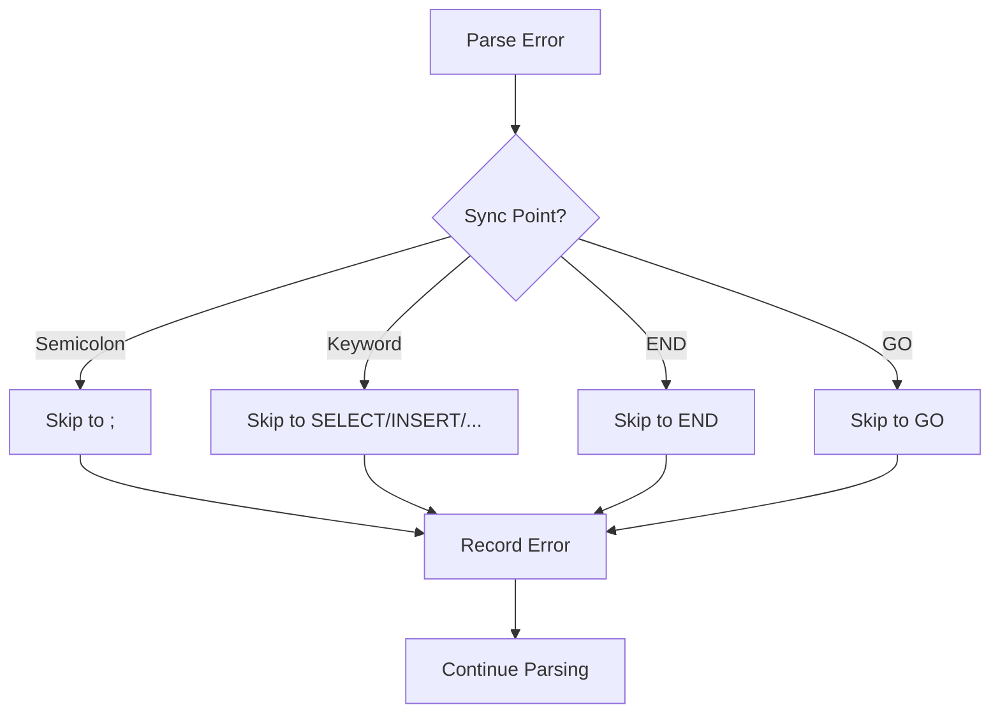
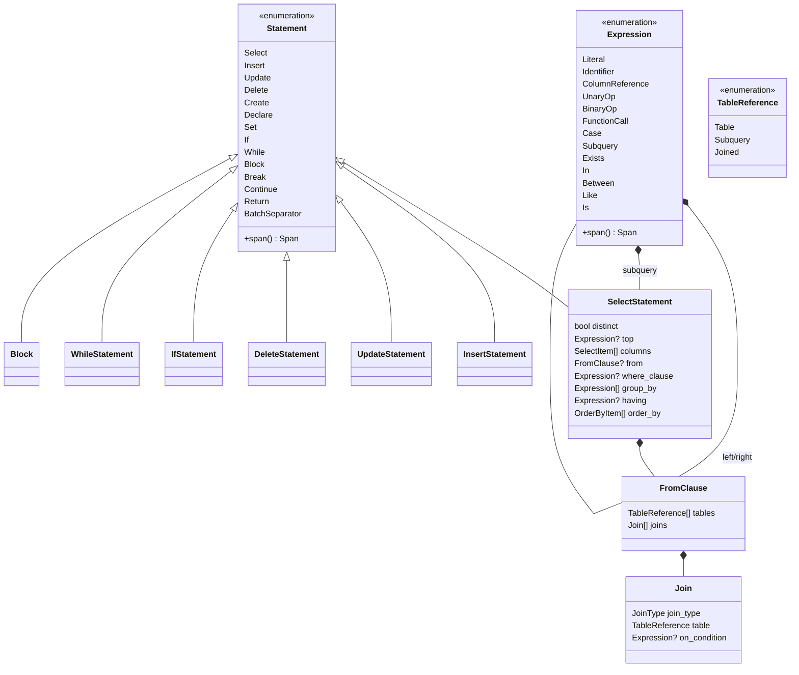
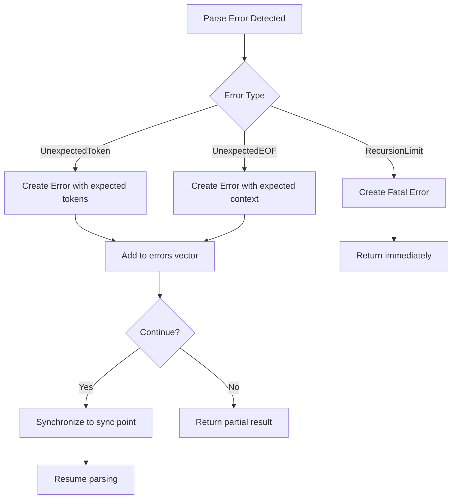

# Design Document: T-SQL Parser for SAP ASE

---

## Overview

この機能は、SAP ASE (Sybase Adaptive Server Enterprise) の T-SQL 方言で記述された SQL コードを構文解析する Parser クレート `tsql-parser` を実装する。Parser は `tsql-lexer` からトークンストリームを受け取り、抽象構文木 (AST) を出力する。

**目的**: SAP ASE から MySQL への SQL 移行を自動化するための、正確で堅牢な T-SQL パーサーを提供する。

**利用者**: Emitter チーム（MySQL 変換）、変換エンジンチーム（AST 変換）、エンドユーザー（エラー検出）

**影響**: 既存の `tsql-lexer` および `tsql-token` クレートに依存し、将来の `common-sql` クレートと統合する。

### Goals

1. **構文解析**: SAP ASE T-SQL の主要な構文を正確に解析する
   - DML: SELECT, INSERT, UPDATE, DELETE
   - DDL: CREATE (TABLE, INDEX, VIEW, PROCEDURE)
   - 制御フロー: IF...ELSE, WHILE, BEGIN...END, BREAK, CONTINUE, RETURN
   - 変数: DECLARE, SET
   - 式: 算術、比較、論理演算子、関数、CASE 式

2. **バッチ処理**: GO キーワードによるバッチ区切りと GO N 形式の繰り返しをサポートする

3. **エラー回復**: 単一のバッチ内で複数のエラーを検出・報告する

4. **Common SQL AST 変換**: 方言非依存の中間表現に変換可能な AST を出力する

5. **パフォーマンス**: 1MB の SQL を 500ms 以内に解析する

### Non-Goals

- **セマンティック解析**: テーブル・カラムの存在確認、型検査は Phase 2 以降
- **実行計画生成**: データベースエンジンの機能、対象外
- **クエリ最適化**: Emitter 側で実施
- **全 ASE 拡張のサポート**: 一般的に使用される構文に限定
- **SQL 整形**: mysql-emitter の責務
- **マルチスレッド解析**: シングルスレッド設計（呼び出し元で並列化可）

---

## Architecture

### Existing Architecture Analysis

**既存コンポーネント**:
- `tsql-token`: TokenKind 列挙型、Position、Span を定義
- `tsql-lexer`: ゼロコピー字句解析器、Token イテレータを提供

**アーキテクチャ制約** (architecture-coupling-balance.md):
- 依存方向: Parser → Lexer のみ（単一方向）
- 内部実装へのアクセス禁止: 公開 API のみ使用
- Common SQL AST: 方言非依存の中間表現へ変換可能

### Architecture Pattern & Boundary Map



**Architecture Integration**:
- **選択パターン**: Recursive Descent Parser + Pratt Parser (式解析)
- **ドメイン境界**:
  - トークン消費: `TokenStream` trait が Lexer とのインターフェース
  - 文解析: Statement ごとの専用メソッド
  - 式解析: Pratt parser で演算子優先順位を処理
  - AST 構築: `AstBuilder` が構文ツリーを組み立て
- **維持される既存パターン**:
  - ゼロコピー設計（Lexer から）
  - Result ベースのエラー処理
  - 位置情報の追跡（Span）
- **新コンポーネントの根拠**:
  - `TokenStream`: Lexer との疎結合インターフェース
  - `PrattParser`: 式の優先順位解析に特化
  - `BatchProcessor`: GO キーワードによるバッチ処理
- **Steering 準拠**:
  - 単一方向の依存 (Parser → Lexer)
  - コントラクト結合 (trait ベース)
  - 型安全性 (所有権付き AST)

### Technology Stack

| Layer | Choice / Version | Role in Feature | Notes |
|-------|------------------|-----------------|-------|
| Parser Core | Rust 2021 edition | メインパーサー実装 | 再帰下降 + Pratt |
| Error Handling | thiserror 2.0 | エラー型定義 | workspace 依存 |
| Static Data | once_cell 1.19 | 演算子優先順位テーブル | workspace 依存 |
| Testing | rstest 0.18 | 表形式テスト | workspace 依存 |
| Benchmarking | criterion 0.5 | パフォーマンス検証 | workspace 依存 |

---

## System Flows

### Parse Flow (Main Sequence)



### Batch Processing Flow



### Error Recovery Flow



---

## Requirements Traceability

| Requirement | Summary | Components | Interfaces | Flows |
|-------------|---------|------------|------------|-------|
| 1 | Lexer 統合 | TokenStream, TokenBuffer | consume(), peek(n) | Parse Flow |
| 2 | SELECT 文 | SelectParser, FromParser, JoinParser | parse_select() | Parse Flow |
| 3 | INSERT 文 | InsertParser | parse_insert() | Parse Flow |
| 4 | UPDATE 文 | UpdateParser | parse_update() | Parse Flow |
| 5 | DELETE 文 | DeleteParser | parse_delete() | Parse Flow |
| 6 | CREATE 文 | CreateParser | parse_create() | Parse Flow |
| 7 | 変数宣言・代入 | VariableParser | parse_declare(), parse_set() | Parse Flow |
| 8 | 制御フロー | ControlFlowParser | parse_if(), parse_while() | Parse Flow |
| 9 | 式解析 | PrattParser, ExpressionParser | parse_expression() | Parse Flow |
| 10 | JOIN 構文 | JoinParser | parse_join() | Parse Flow |
| 11 | サブクエリ | SubqueryParser | parse_subquery() | Parse Flow |
| 12 | 一時テーブル | TempTableParser | parse_temp_table() | Parse Flow |
| 13 | エラーハンドリング | ErrorHandler, RecoveryManager | synchronize() | Error Recovery |
| 14 | Common SQL AST 変換 | ToCommonAst trait | to_common_ast() | - |
| 15 | データ型解析 | DataTypeParser | parse_data_type() | Parse Flow |
| 16 | GO バッチ区切り | BatchProcessor, GoDetector | parse_batch() | Batch Flow |
| 17 | 非 GO SQL | SingleStatementParser | parse_single() | Parse Flow |
| 18 | モード切り替え | ParserConfig | set_batch_mode() | Batch Flow |
| 19 | GO エラーハンドリング | BatchErrorHandler | handle_batch_error() | Error Recovery |

---

## Components and Interfaces

### Component Summary

| Component | Domain/Layer | Intent | Req Coverage | Key Dependencies | Contracts |
|-----------|--------------|--------|--------------|------------------|-----------|
| TokenStream | Core | Lexer とのインターフェース | 1 | tsql-lexer (P0) | Service |
| TokenBuffer | Core | 先読みバッファ | 1 | - | State |
| Parser | Core | メインパーサー | 全 | TokenStream (P0) | Service |
| StatementParser | Core | 文レベル解析 | 2-8, 15-17 | TokenBuffer (P0) | Service |
| ExpressionParser | Core | 式解析 (Pratt) | 9, 11 | TokenBuffer (P0) | Service |
| JoinParser | Core | JOIN 構文解析 | 10 | TokenBuffer (P0) | Service |
| BatchProcessor | Core | バッチ処理 | 16, 18, 19 | TokenBuffer (P0) | Service |
| ErrorHandler | Core | エラー回復 | 13 | TokenBuffer (P0) | Service |
| AstBuilder | Core | AST 構築 | 全 | - | Service |
| ast モジュール | AST | AST ノード定義 | 全 | tsql-token (P0) | API |

---

### Core Domain

#### Parser

| Field | Detail |
|-------|--------|
| Intent | トークンストリームを解析して AST を生成するメインパーサー |
| Requirements | 全 |
| Owner / Reviewers | - |

**Responsibilities & Constraints**
- トークンストリームを消費して文レベルの構文解析を実行
- バッチモードと単一文モードの切り替え
- エラー収集と回復の調整
- AST ノードの生成と構築

**Dependencies**
- Inbound: - (エントリーポイント)
- Outbound: TokenStream — トークン消費 (Criticality: P0)
- Outbound: StatementParser — 文解析委譲 (Criticality: P0)
- Outbound: ErrorHandler — エラー処理 (Criticality: P0)

**Contracts**: Service [X] / API [ ] / Event [ ] / Batch [ ] / State [ ]

##### Service Interface

```rust
use tsql_lexer::Lexer;
use crate::ast::Statement;
use crate::error::ParseResult;

pub struct Parser<'src> {
    lexer: Lexer<'src>,
    buffer: TokenBuffer<'src>,
    errors: Vec<ParseError>,
    mode: ParserMode,
}

pub enum ParserMode {
    BatchMode,      // GO をバッチ区切りとして認識
    SingleStatement, // GO を識別子として扱う
}

impl<'src> Parser<'src> {
    /// 新しいパーサーを作成
    pub fn new(input: &'src str) -> Self;

    /// パーサーモードを設定
    pub fn with_mode(mut self, mode: ParserMode) -> Self;

    /// 入力全体を解析（バッチモードでは複数のバッチを返す）
    pub fn parse(&mut self) -> ParseResult<Vec<Statement>>;

    /// 単一の文を解析
    pub fn parse_statement(&mut self) -> ParseResult<Statement>;

    /// 収集されたエラーを返す
    pub fn errors(&self) -> &[ParseError];

    /// エラーを消費して取得
    pub fn drain_errors(&mut self) -> Vec<ParseError>;
}
```

- Preconditions: 入力は UTF-8 でエンコードされている
- Postconditions: エラーがあっても可能な限り解析を継続
- Invariants: buffer.size >= 1 (常に先読みあり)

**Implementation Notes**
- Integration: Lexer の Iterator 実装を TokenStream でラップ
- Validation: 入力サイズ上限チェック (100MB)
- Risks: 深い再帰によるスタックオーバーフロー (深度制限: 1000)

---

#### TokenBuffer

| Field | Detail |
|-------|--------|
| Intent | トークンの先読みバッファ (サイズ 3+) |
| Requirements | 1 |
| Owner / Reviewers | - |

**Responsibilities & Constraints**
- トークンの先読み (peek) と消費 (consume) を提供
- 循環バッファで固定サイズ (3トークン) の先読みを実現
- Lexer からの透過的なトークン取得

**Dependencies**
- Inbound: Parser — 消費リクエスト (P0)
- Outbound: Lexer — トークン取得 (P0)

**Contracts**: State [X] / Service [X]

##### State Management

```rust
pub struct TokenBuffer<'src> {
    lexer: Lexer<'src>,
    buffer: [Option<Token<'src>>; 3],
    cursor: usize,
}

impl<'src> TokenBuffer<'src> {
    /// 新しいバッファを作成 (最初のトークンで初期化)
    pub fn new(lexer: Lexer<'src>) -> ParseResult<Self>;

    /// 現在のトークンを返す (消費しない)
    pub fn current(&self) -> ParseResult<&Token<'src>>;

    /// n 番目の先読みトークンを返す (0=現在)
    pub fn peek(&self, n: usize) -> ParseResult<&Token<'src>>;

    /// 現在のトークンを消費して次に進む
    pub fn consume(&mut self) -> ParseResult<Token<'src>>;

    /// 現在のトークンが指定された種別かチェック
    pub fn check(&self, kind: TokenKind) -> bool;

    /// 指定された種別の場合に消費
    pub fn consume_if(&mut self, kind: TokenKind) -> ParseResult<bool>;
}
```

**Implementation Notes**
- Integration: Lexer の peek 機能を活用して先読み実装
- Validation: peek(2) で常に3トークン先読み可能

---

#### StatementParser

| Field | Detail |
|-------|--------|
| Intent | 文レベルの構文解析を各文種別に委譲 |
| Requirements | 2-8, 15-17 |
| Owner / Reviewers | - |

**Responsibilities & Constraints**
- 先頭トークンに基づいて適切な解析メソッドに委譲
- 各文種別の解析メソッドを提供
- 文終了の検出 (; または次のキーワード)

**Dependencies**
- Inbound: Parser — 解析リクエスト (P0)
- Outbound: TokenBuffer — トークン消費 (P0)
- Outbound: ExpressionParser — 式解析 (P0)

**Contracts**: Service [X]

##### Service Interface

```rust
impl<'src> Parser<'src> {
    // 文レベルの委譲メソッド

    fn parse_select_statement(&mut self) -> ParseResult<Statement>;
    fn parse_insert_statement(&mut self) -> ParseResult<Statement>;
    fn parse_update_statement(&mut self) -> ParseResult<Statement>;
    fn parse_delete_statement(&mut self) -> ParseResult<Statement>;
    fn parse_create_statement(&mut self) -> ParseResult<Statement>;
    fn parse_declare_statement(&mut self) -> ParseResult<Statement>;
    fn parse_set_statement(&mut self) -> ParseResult<Statement>;
    fn parse_if_statement(&mut self) -> ParseResult<Statement>;
    fn parse_while_statement(&mut self) -> ParseResult<Statement>;
    fn parse_block(&mut self) -> ParseResult<Statement>;
    fn parse_break_statement(&mut self) -> ParseResult<Statement>;
    fn parse_continue_statement(&mut self) -> ParseResult<Statement>;
    fn parse_return_statement(&mut self) -> ParseResult<Statement>;
}
```

**Implementation Notes**
- 各メソッドは専用の文構造を解析
- エラー時は同期ポイントまでスキップして回復

---

#### ExpressionParser (Pratt Parser)

| Field | Detail |
|-------|--------|
| Intent | 式の演算子優先順位を正しく解析 |
| Requirements | 9, 11 |
| Owner / Reviewers | - |

**Responsibilities & Constraints**
- プラット解析アルゴリズムで演算子優先順位を処理
- 前置、中置、後置演算子に対応
- 再帰深度制限 (1000) を適用

**Dependencies**
- Inbound: StatementParser — 式解析リクエスト (P0)
- Outbound: TokenBuffer — トークン消費 (P0)

**Contracts**: Service [X]

##### Service Interface

```rust
// 演算子結合力 (precedence)
#[derive(Clone, Copy, PartialEq, Eq, PartialOrd, Ord)]
pub enum BindingPower {
    Lowest = 0,
    LogicalOr,   // OR
    LogicalAnd,  // AND
    Comparison,  // =, <>, <, >, <=, >=, !<, !>
    Is,          // IS, IN, LIKE, BETWEEN
    Additive,    // +, -, ||
    Multiplicative, // *, /, %
    Unary,       // -, ~, NOT
    Primary,     // リテラル、識別子、括弧
}

impl<'src> Parser<'src> {
    /// 式を解析 (優先順位最低位から開始)
    fn parse_expression(&mut self) -> ParseResult<Expression> {
        self.parse_expression_bp(BindingPower::Lowest)
    }

    /// プラット解析: 指定した結合力以上の式を解析
    fn parse_expression_bp(&mut self, min_bp: BindingPower) -> ParseResult<Expression>;

    /// 前置演算子の null denotation
    fn parse_prefix(&mut self) -> ParseResult<Expression>;

    /// 中置演算子の left denotation
    fn parse_infix(&mut self, left: Expression) -> ParseResult<Expression>;

    /// 一次式: リテラル、識別子、括弧式、サブクエリ
    fn parse_primary(&mut self) -> ParseResult<Expression>;
}
```

**Implementation Notes**
- Integration: 全ての式解析は `parse_expression()` をエントリーポイント
- Validation: 再帰深度カウンタでオーバーフロー防止

---

#### JoinParser

| Field | Detail |
|-------|--------|
| Intent | JOIN 構文の解析 |
| Requirements | 10 |
| Owner / Reviewers | - |

**Responsibilities & Constraints**
- INNER, LEFT, RIGHT, FULL, CROSS JOIN を解析
- ON 句と USING 句を処理
- 複数の JOIN の連結を解析

**Dependencies**
- Inbound: StatementParser (SELECT, UPDATE) — JOIN 解析 (P0)
- Outbound: TokenBuffer — トークン消費 (P0)
- Outbound: ExpressionParser — ON 条件式 (P0)

**Contracts**: Service [X]

##### Service Interface

```rust
#[derive(Debug, Clone, PartialEq)]
pub enum JoinType {
    Inner,
    Left,
    LeftOuter,
    Right,
    RightOuter,
    Full,
    FullOuter,
    Cross,
}

#[derive(Debug, Clone)]
pub struct Join {
    pub join_type: JoinType,
    pub table: TableReference,
    pub on_condition: Option<Expression>,
    pub using_columns: Vec<Identifier>,
    pub alias: Option<Identifier>,
}

impl<'src> Parser<'src> {
    /// JOIN を解析
    fn parse_join(&mut self) -> ParseResult<Join>;

    /// JOIN の種別を解析
    fn parse_join_type(&mut self) -> ParseResult<Option<JoinType>>;
}
```

**Implementation Notes**
- JOIN キーワード検出で開始
- 複数 JOIN の連結: `parse_joins()` で Vec<Join> を返す

---

#### BatchProcessor

| Field | Detail |
|-------|--------|
| Intent | GO キーワードによるバッチ処理 |
| Requirements | 16, 18, 19 |
| Owner / Reviewers | - |

**Responsibilities & Constraints**
- GO キーワードをバッチ区切りとして認識
- GO N 形式で繰り返し回数を解析
- 行単位での GO 認識 (文字列・コメント内の GO を除外)
- バッチ単位のエラー報告

**Dependencies**
- Inbound: Parser — バッチ処理リクエスト (P0)
- Outbound: TokenBuffer — トークン消費 (P0)
- Outbound: ErrorHandler — エラー報告 (P0)

**Contracts**: Service [X] / Batch [X]

##### Service Interface

```rust
#[derive(Debug, Clone)]
pub struct BatchSeparator {
    pub repeat_count: Option<u32>,  // GO N の N
    pub position: Position,
}

#[derive(Debug, Clone)]
pub struct Batch {
    pub statements: Vec<Statement>,
    pub separator: Option<BatchSeparator>,
    pub batch_number: usize,
}

impl<'src> Parser<'src> {
    /// バッチモードで入力全体を解析
    fn parse_batches(&mut self) -> ParseResult<Vec<Batch>>;

    /// GO キーワードか判定 (行単位チェック)
    fn is_go_keyword(&self, token: &Token) -> bool;

    /// GO N 形式を解析
    fn parse_go_repeat(&mut self) -> ParseResult<Option<u32>>;
}
```

##### Batch / Job Contract
- Trigger: EOF または GO キーワード検出
- Input / validation: 各バッチの妥当性を検証、エラーがあっても継続
- Output / destination: Vec<Batch> (各バッチに文リストとエラーを含む)
- Idempotency & recovery: バッチ単位でエラー回復、次のバッチから継続

---

#### ErrorHandler

| Field | Detail |
|-------|--------|
| Intent | エラー検出、報告、回復 |
| Requirements | 13, 19 |
| Owner / Reviewers | - |

**Responsibilities & Constraints**
- 構文エラーを検出して `ParseError` を生成
- 同期ポイントまでスキップして回復
- 複数のエラーを収集
- エラー位置情報を保持

**Dependencies**
- Inbound: 全 Parser — エラー通知 (P0)
- Outbound: - (最下位)

**Contracts**: Service [X]

##### Service Interface

```rust
use tsql_token::{Position, Span, TokenKind};

#[derive(Debug, Clone, PartialEq)]
pub enum ParseError {
    UnexpectedToken {
        expected: Vec<TokenKind>,
        found: TokenKind,
        span: Span,
    },
    UnexpectedEof {
        expected: String,
        position: Position,
    },
    InvalidSyntax {
        message: String,
        span: Span,
    },
    RecursionLimitExceeded {
        limit: usize,
        position: Position,
    },
    BatchError {
        batch_number: usize,
        error: Box<ParseError>,
    },
}

// 同期ポイントを定義
fn is_synchronization_point(kind: TokenKind) -> bool {
    matches!(
        kind,
        TokenKind::Semicolon
            | TokenKind::Select
            | TokenKind::Insert
            | TokenKind::Update
            | TokenKind::Delete
            | TokenKind::Create
            | TokenKind::End
            | TokenKind::Go
    )
}

impl<'src> Parser<'src> {
    /// エラーを記録して同期ポイントまでスキップ
    fn synchronize(&mut self, error: ParseError) {
        self.errors.push(error);
        while let Ok(token) = self.buffer.current() {
            if is_synchronization_point(token.kind) {
                break;
            }
            let _ = self.buffer.consume();
        }
    }
}
```

**Implementation Notes**
- Integration: 全解析メソッドから synchronize() を呼び出し
- Validation: エラーメッセージには位置情報を含める

---

### AST Domain

#### ast モジュール (AST ノード定義)

| Field | Detail |
|-------|--------|
| Intent | 抽象構文木のノード型定義 |
| Requirements | 全 |
| Owner / Reviewers | - |

**Responsibilities & Constraints**
- 全ての AST ノード型を定義
- 各ノードに位置情報 (Span) を保持
- Common SQL AST への変換トレイトを実装

**Dependencies**
- Inbound: AstBuilder — ノード生成 (P0)
- Outbound: tsql-token — Span, Position 使用 (P0)

**Contracts**: API [X]

##### API Contract

```rust
use tsql_token::{Span, Position};

/// 全ての AST ノードの基底トレイト
pub trait AstNode {
    fn span(&self) -> &Span;
}

/// 文
#[derive(Debug, Clone)]
pub enum Statement {
    Select(SelectStatement),
    Insert(InsertStatement),
    Update(UpdateStatement),
    Delete(DeleteStatement),
    Create(CreateStatement),
    Declare(DeclareStatement),
    Set(SetStatement),
    If(IfStatement),
    While(WhileStatement),
    Block(Block),
    Break(BreakStatement),
    Continue(ContinueStatement),
    Return(ReturnStatement),
    BatchSeparator(BatchSeparator),
}

impl AstNode for Statement {
    fn span(&self) -> &Span;
}

/// SELECT 文
#[derive(Debug, Clone)]
pub struct SelectStatement {
    pub span: Span,
    pub distinct: bool,
    pub top: Option<Expression>,
    pub columns: Vec<SelectItem>,
    pub from: Option<FromClause>,
    pub where_clause: Option<Expression>,
    pub group_by: Vec<Expression>,
    pub having: Option<Expression>,
    pub order_by: Vec<OrderByItem>,
    pub limit: Option<LimitClause>,
}

/// 式
#[derive(Debug, Clone)]
pub enum Expression {
    Literal(Literal),
    Identifier(Identifier),
    ColumnReference(ColumnReference),
    UnaryOp {
        op: UnaryOperator,
        expr: Box<Expression>,
        span: Span,
    },
    BinaryOp {
        left: Box<Expression>,
        op: BinaryOperator,
        right: Box<Expression>,
        span: Span,
    },
    FunctionCall(FunctionCall),
    Case(CaseExpression),
    Subquery(Box<SelectStatement>),
    Exists(Box<SelectStatement>),
    In {
        expr: Box<Expression>,
        list: InList,
        negated: bool,
        span: Span,
    },
    Between {
        expr: Box<Expression>,
        low: Box<Expression>,
        high: Box<Expression>,
        negated: bool,
        span: Span,
    },
    Like {
        expr: Box<Expression>,
        pattern: Box<Expression>,
        escape: Option<Box<Expression>>,
        negated: bool,
        span: Span,
    },
    Is {
        expr: Box<Expression>,
        negated: bool,
        value: IsValue,
        span: Span,
    },
}

#[derive(Debug, Clone)]
pub enum Literal {
    String(String),
    Number(String),
    Float(String),
    Hex(String),
    Null,
    Boolean(bool),
}

#[derive(Debug, Clone)]
pub struct Identifier {
    pub name: String,
    pub span: Span,
}

#[derive(Debug, Clone)]
pub struct ColumnReference {
    pub table: Option<Identifier>,
    pub column: Identifier,
    pub span: Span,
}

#[derive(Debug, Clone, Copy)]
pub enum UnaryOperator {
    Plus, Minus, Tilde, Not,
}

#[derive(Debug, Clone, Copy)]
pub enum BinaryOperator {
    Plus, Minus, Multiply, Divide, Modulo,
    Eq, Ne, NeAlt, Lt, Le, Gt, Ge, NotLt, NotGt,
    And, Or,
    Concat,
}

#[derive(Debug, Clone)]
pub struct FunctionCall {
    pub name: Identifier,
    pub args: Vec<FunctionArg>,
    pub distinct: bool,
    pub span: Span,
}

#[derive(Debug, Clone)]
pub enum FunctionArg {
    Expression(Expression),
    QualifiedWildcard(Identifier),
    Wildcard,
}

#[derive(Debug, Clone)]
pub struct CaseExpression {
    pub branches: Vec<(Expression, Expression)>,
    pub else_result: Option<Box<Expression>>,
    pub span: Span,
}

#[derive(Debug, Clone)]
pub enum InList {
    Values(Vec<Expression>),
    Subquery(Box<SelectStatement>),
}

#[derive(Debug, Clone)]
pub enum IsValue {
    Null,
    True,
    False,
    Unknown,
}

/// FROM 句
#[derive(Debug, Clone)]
pub struct FromClause {
    pub tables: Vec<TableReference>,
    pub joins: Vec<Join>,
}

#[derive(Debug, Clone)]
pub enum TableReference {
    Table {
        name: Identifier,
        alias: Option<Identifier>,
        span: Span,
    },
    Subquery {
        query: Box<SelectStatement>,
        alias: Option<Identifier>,
        span: Span,
    },
    Joined {
        joins: Vec<Join>,
        span: Span,
    },
}

/// JOIN
#[derive(Debug, Clone)]
pub struct Join {
    pub join_type: JoinType,
    pub table: TableReference,
    pub on_condition: Option<Expression>,
    pub using_columns: Vec<Identifier>,
    pub span: Span,
}

#[derive(Debug, Clone, Copy)]
pub enum JoinType {
    Inner, Left, LeftOuter, Right, RightOuter,
    Full, FullOuter, Cross,
}

/// SELECT アイテム
#[derive(Debug, Clone)]
pub enum SelectItem {
    Expression(Expression, Option<Identifier>),
    Wildcard,
    QualifiedWildcard(Identifier),
}

/// ORDER BY アイテム
#[derive(Debug, Clone)]
pub struct OrderByItem {
    pub expr: Expression,
    pub asc: bool,
}

/// LIMIT 句
#[derive(Debug, Clone)]
pub struct LimitClause {
    pub limit: Expression,
    pub offset: Option<Expression>,
}

/// INSERT 文
#[derive(Debug, Clone)]
pub struct InsertStatement {
    pub span: Span,
    pub table: Identifier,
    pub columns: Vec<Identifier>,
    pub source: InsertSource,
}

#[derive(Debug, Clone)]
pub enum InsertSource {
    Values(Vec<Vec<Expression>>),
    Select(Box<SelectStatement>),
    DefaultValues,
}

/// UPDATE 文
#[derive(Debug, Clone)]
pub struct UpdateStatement {
    pub span: Span,
    pub table: TableReference,
    pub assignments: Vec<Assignment>,
    pub from_clause: Option<FromClause>,
    pub where_clause: Option<Expression>,
}

#[derive(Debug, Clone)]
pub struct Assignment {
    pub column: Identifier,
    pub value: Expression,
}

/// DELETE 文
#[derive(Debug, Clone)]
pub struct DeleteStatement {
    pub span: Span,
    pub table: Identifier,
    pub from_clause: Option<FromClause>,
    pub where_clause: Option<Expression>,
}

/// CREATE 文
#[derive(Debug, Clone)]
pub enum CreateStatement {
    Table(TableDefinition),
    Index(IndexDefinition),
    View(ViewDefinition),
    Procedure(ProcedureDefinition),
}

#[derive(Debug, Clone)]
pub struct TableDefinition {
    pub span: Span,
    pub name: Identifier,
    pub columns: Vec<ColumnDefinition>,
    pub constraints: Vec<TableConstraint>,
    pub temporary: bool,
}

#[derive(Debug, Clone)]
pub struct ColumnDefinition {
    pub name: Identifier,
    pub data_type: DataType,
    pub nullability: Option<bool>,
    pub default_value: Option<Expression>,
    pub identity: bool,
}

#[derive(Debug, Clone)]
pub enum DataType {
    Int,
    Varchar(Option<u32>),
    Char(u32),
    Decimal(Option<u8>, Option<u8>),
    Datetime,
    Bit,
    Text,
    // ... 他のデータ型
}

#[derive(Debug, Clone)]
pub enum TableConstraint {
    PrimaryKey { columns: Vec<Identifier> },
    Foreign { columns: Vec<Identifier>, ref_table: Identifier, ref_columns: Vec<Identifier> },
    Unique { columns: Vec<Identifier> },
    Check { expr: Expression },
}

/// DECLARE 文
#[derive(Debug, Clone)]
pub struct DeclareStatement {
    pub span: Span,
    pub variables: Vec<VariableDeclaration>,
}

#[derive(Debug, Clone)]
pub struct VariableDeclaration {
    pub name: Identifier,  // @variable
    pub data_type: DataType,
    pub default_value: Option<Expression>,
}

/// SET 文
#[derive(Debug, Clone)]
pub struct SetStatement {
    pub span: Span,
    pub variable: Identifier,
    pub value: Expression,
}

/// IF 文
#[derive(Debug, Clone)]
pub struct IfStatement {
    pub span: Span,
    pub condition: Expression,
    pub then_branch: Statement,
    pub else_branch: Option<Statement>,
}

/// WHILE 文
#[derive(Debug, Clone)]
pub struct WhileStatement {
    pub span: Span,
    pub condition: Expression,
    pub body: Statement,
}

/// ブロック
#[derive(Debug, Clone)]
pub struct Block {
    pub span: Span,
    pub statements: Vec<Statement>,
}

/// BREAK 文
#[derive(Debug, Clone)]
pub struct BreakStatement {
    pub span: Span,
}

/// CONTINUE 文
#[derive(Debug, Clone)]
pub struct ContinueStatement {
    pub span: Span,
}

/// RETURN 文
#[derive(Debug, Clone)]
pub struct ReturnStatement {
    pub span: Span,
    pub expression: Option<Expression>,
}

/// バッチ区切り
#[derive(Debug, Clone)]
pub struct BatchSeparator {
    pub repeat_count: Option<u32>,
    pub position: Position,
}
```

---

## Data Models

### Domain Model



**Aggregates**: `Statement` が集約ルート
**Transaction Boundaries**: 各 `Statement` が独立したトランザクション境界
**Business Rules**:
- SELECT: columns は空であってはならない
- INSERT: VALUES と SELECT は排他
- UPDATE: assignments は少なくとも1つ必要
- WHILE/BLOCK: 入れ子の深さは 1000 以下

---

## Error Handling

### Error Strategy

| エラー種別 | 検出 | 回復方法 | 報告 |
|-----------|------|----------|------|
| UnexpectedToken | トークン種別チェック | 同期ポイントまでスキップ | ParseError::UnexpectedToken |
| UnexpectedEOF | EOF での期待トークン不在 | パース中止 | ParseError::UnexpectedEof |
| InvalidSyntax | 構文規則違反 | 文単位で回復 | ParseError::InvalidSyntax |
| RecursionLimitExceeded | 再帰深度カウンタ | パース中止 | ParseError::RecursionLimitExceeded |
| BatchError | バッチ内エラー | 次のバッチから継続 | ParseError::BatchError |

### Error Categories and Responses

**User Errors** (4xx 相当):
- 不正なトークン: 期待されるトークン候補を列挙
- 不完全な文: 期待されていた要素を示唆
- 構文違反: 具体的な問題を説明

**System Errors** (5xx 相当):
- 再帰限界超過: 再帰深度制限を通知
- 入力サイズ超過: 100MB 制限を通知

**Process Flow Visualization**:



### Monitoring

- **Error tracking**: `Vec<ParseError>` で全エラーを収集
- **Logging**: エラー位置、期待値、実際のトークンを記録
- **Health**: `has_errors()` メソッドでエラー有無を判定

---

## Testing Strategy

### Unit Tests (カバレッジ 80%+)

| モジュール | テスト項目 |
|-----------|-----------|
| TokenBuffer | peek, consume, current, consume_if |
| ExpressionParser | 全演算子の優先順位、結合性、カッコ式 |
| StatementParser | 各文種別の正常・異常ケース |
| JoinParser | 全 JOIN タイプ、ON/USING 句 |
| BatchProcessor | GO 検出、GO N、非 GO モード |
| ErrorHandler | 同期ポイント、エラーメッセージ |

### Integration Tests

1. **SELECT 文の完全解析**: 複雑な JOIN、WHERE、GROUP BY、ORDER BY
2. **バッチ処理**: 複数のバッチ、エラーを含むバッチ
3. **入れ子の式**: 深い演算子の入れ子
4. **制御フロー**: IF...ELSE、WHILE、BEGIN...END

### E2E Tests (if applicable)

1. **実際の SAP ASE スクリプト**: 本格的な SQL ファイルを解析
2. **エラー回復**: 複数のエラーを含む入力

### Performance / Load

| 項目 | 目標 | 測定方法 |
|------|------|----------|
| 1MB 解析 | <= 500ms | criterion ベンチマーク |
| メモリ使用量 | <= 入力 × 3 | heaptrack |
| 再帰深度 | <= 1000 | 静的チェック |

---

## Performance & Scalability

### Target Metrics and Measurement Strategies

| メトリクス | 目標値 | 測定方法 |
|-----------|--------|----------|
| 解析速度 (1MB) | <= 500ms | criterion ベンチマーク |
| 解析速度 (100MB) | <= 60s | criterion ベンチマーク |
| メモリ使用量 | <= 入力 × 3 | heaptrack |
| 再帰深度 | <= 1000 | カウンタチェック |

### Scaling Approaches

- **垂直スケーリング**: シングルスレッド設計、呼び出し元で並列化
- **水平スケーリング**: 対応しない（パーサーはステートフル）

### Caching Strategies and Optimization Techniques

- **静的データ**: 演算子優先順位テーブルを `once_cell` でキャッシュ
- **ゼロコピー**: Lexer からの入力を参照で保持
- **先読みバッファ**: 固定サイズの循環バッファ

---

## Optional Sections

### Security Considerations

- **入力サイズ制限**: 100MB を上限として DoS 攻撃を防止
- **スタックオーバーフロー防止**: 再帰深度を 1000 に制限
- **安全なエラー処理**: エラーメッセージにソースコードの一部のみを含める (80文字)

---

## Supporting References

### Operator Precedence Table

| 優先度 | 演算子 | 結合性 | BindingPower |
|--------|--------|--------|--------------|
| 1 (最高) | `~`, `-`, `NOT` | 右 | Unary |
| 2 | `*`, `/`, `%` | 左 | Multiplicative |
| 3 | `+`, `-`, `\|\|` | 左 | Additive |
| 4 | `=`, `<>`, `!=`, `<`, `>`, `<=`, `>=`, `!<`, `!>` | 左 | Comparison |
| 5 | `IS`, `IN`, `LIKE`, `BETWEEN` | - | Is |
| 6 | `AND` | 左 | LogicalAnd |
| 7 (最低) | `OR` | 左 | LogicalOr |

### Synchronization Points

```rust
fn is_synchronization_point(kind: TokenKind) -> bool {
    matches!(
        kind,
        TokenKind::Semicolon      // ;
            | TokenKind::Select   // SELECT
            | TokenKind::Insert   // INSERT
            | TokenKind::Update   // UPDATE
            | TokenKind::Delete   // DELETE
            | TokenKind::Create   // CREATE
            | TokenKind::Alter    // ALTER
            | TokenKind::Drop     // DROP
            | TokenKind::End      // END
            | TokenKind::Go       // GO (識別子としての GO を除く)
    )
}
```

---

**文書メタデータ**:
- 総セクション数: 11
- 要件カバレッジ: 19/19 (100%)
- 定義されたコンポーネント: 8
- 定義された AST ノード: 30+
